# Multi-pedestrian interaction with automated vehicle


## Citation
If you use the simulator for academic work please cite the following papers:

>  


## Getting started
[](https://www.python.org/downloads/release/python-3919/)
[](https://docs.astral.sh/uv/)

Tested with **Python 3.12.3** and the [`uv`](https://docs.astral.sh/uv/) package manager.  
Follow these steps to set up the project.

**Step 1:** Install `uv`. `uv` is a fast Python package and environment manager. Install it using one of the following methods:

**macOS / Linux (bash/zsh):**
```bash
curl -LsSf https://astral.sh/uv/install.sh | sh
```

**Windows (PowerShell):**
```powershell
irm https://astral.sh/uv/install.ps1 | iex
```

**Alternative (if you already have Python and pip):**
```bash
pip install uv
```

**Step 2:** Fix permissions (if needed):t

Sometimes `uv` needs to create a folder under `~/.local/share/uv/python` (macOS/Linux) or `%LOCALAPPDATA%\uv\python` (Windows).  
If this folder was created by another tool (e.g. `sudo`), you may see an error like:
```lua
error: failed to create directory ... Permission denied (os error 13)
```

To fix it, ensure you own the directory:

### macOS / Linux
```bash
mkdir -p ~/.local/share/uv
chown -R "$(id -un)":"$(id -gn)" ~/.local/share/uv
chmod -R u+rwX ~/.local/share/uv
```

### Windows
```powershell
# Create directory if it doesn't exist
New-Item -ItemType Directory -Force "$env:LOCALAPPDATA\uv"

# Ensure you (the current user) own it
# (usually not needed, but if permissions are broken)
icacls "$env:LOCALAPPDATA\uv" /grant "$($env:UserName):(OI)(CI)F"
```

**Step 3:** After installing, verify:
```bash
uv --version
```

**Step 4:** Clone the repository:
```command line
git clone https://github.com/Shaadalam9/multiped-learning
cd multiped
```

**Step 5:** Ensure correct Python version. If you don’t already have Python 3.12.3 installed, let `uv` fetch it:
```command line
uv python install 3.12.3
```
The repo should contain a .python-version file so `uv` will automatically use this version.

**Step 6:** Create and sync the virtual environment. This will create **.venv** in the project folder and install dependencies exactly as locked in **uv.lock**:
```command line
uv sync --frozen
```

**Step 7:** Activate the virtual environment:

**macOS / Linux (bash/zsh):**
```bash
source .venv/bin/activate
```

**Windows (PowerShell):**
```powershell
.\.venv\Scripts\Activate.ps1
```

**Windows (cmd.exe):**
```bat
.\.venv\Scripts\activate.bat
```

**Step 8:** Ensure that dataset are present. Place required datasets (including **mapping.csv**) into the **data/** directory:


**Step 9:** Run the code:
```command line
python3 analysis.py
```

## Configuration of project
Configuration of the project needs to be defined in `multiped/config`. Please use the `default.config` file for the required structure of the file. If no custom config file is provided, `default.config` is used. The config file has the following parameters:
* `mapping`: CSV file that contains all data found in the videos.
* `plotly_template`: Template used to make graphs in the analysis.
* `output`: Directory where analysis results and intermediate output files will be saved.
* `figures`: Directory where final figures and plots are stored.
* `data`: Directory containing all raw and processed data files used in the analysis.
* `intake_questionnaire`: CSV file containing participant responses from the intake (pre-experiment) questionnaire.
* `post_experiment_questionnaire`: CSV file containing participant responses from the post-experiment questionnaire.
* `compare_trial`: Reference trial against which all other trials are compared during t-tests in the analysis.
* `kp_resolution`: Time bin size, in milliseconds, used for storing keypress data, which controls the resolution of keypress event logs.
* `yaw_resolution`: Time bin size, in milliseconds, used for storing yaw (head rotation) data, controlling the resolution of HMD orientation data.
* `smoothen_signal`:  Boolean toggle to enable or disable signal smoothing for data analysis.
* `freq`: Frequency parameter used by the One Euro Filter for signal smoothing.
* `mincutoff`: Minimum cutoff frequency for the One Euro Filter.
* `beta`: Beta value controlling the speed-versus-smoothness tradeoff in the One Euro Filter.
* `font_family`: Font family to be used in all generated figures for visual consistency.
* `font_size`: Font size to be applied to all text in generated figures.
* `p_value`: p-value threshold to be used for statistical significance testing (e.g., in t-tests).


## Results

[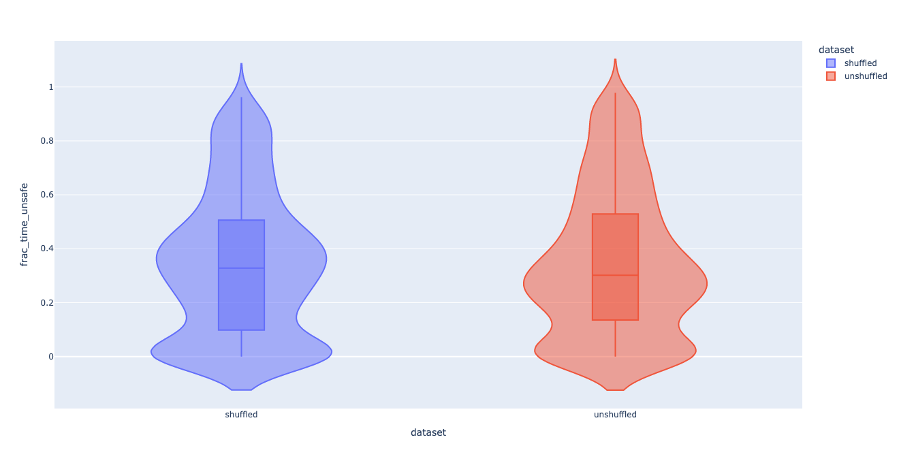](https://htmlpreview.github.io/?https://github.com/Shaadalam9/multiped-learning/blob/main/figures/compare_violin_frac_time_unsafe.html)
Trial level distribution of the fraction of time spent in the unsafe zone. Larger values indicate that participants spent more of the trial in a state classified as unsafe.

[](https://htmlpreview.github.io/?https://github.com/Shaadalam9/multiped-learning/blob/main/figures/compare_violin_trigger_mean.html)
Trial level distribution of the mean continuous unsafety signal. Larger values indicate greater average perceived unsafety during the trial.

[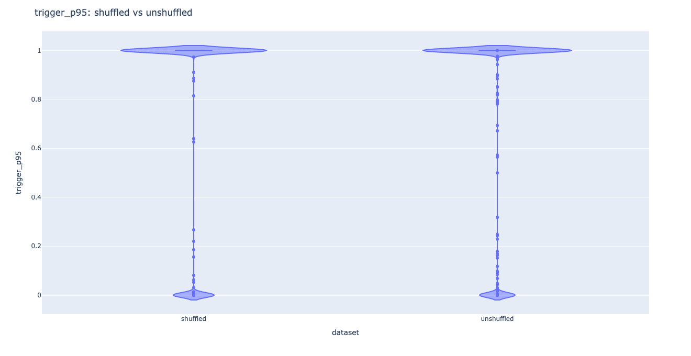](https://htmlpreview.github.io/?https://github.com/Shaadalam9/multiped-learning/blob/main/figures/compare_violin_trigger_p95.html)
Trial level distribution of peak unsafety, summarised by the ninety fifth percentile of the trigger signal within each trial.

[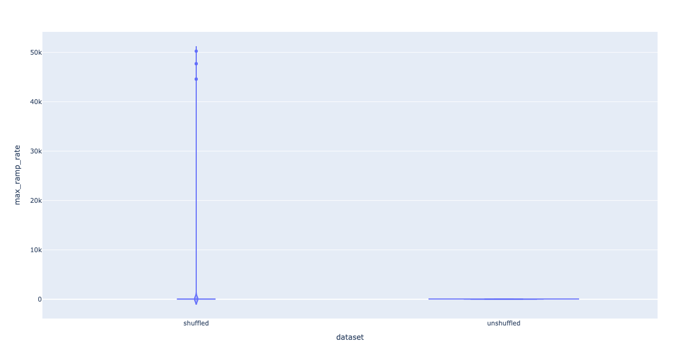](https://htmlpreview.github.io/?https://github.com/Shaadalam9/multiped-learning/blob/main/figures/compare_violin_max_ramp_rate.html)
Trial level distribution of the maximum rate of increase in the continuous unsafety signal. Larger values indicate sharper escalations in perceived unsafety.

[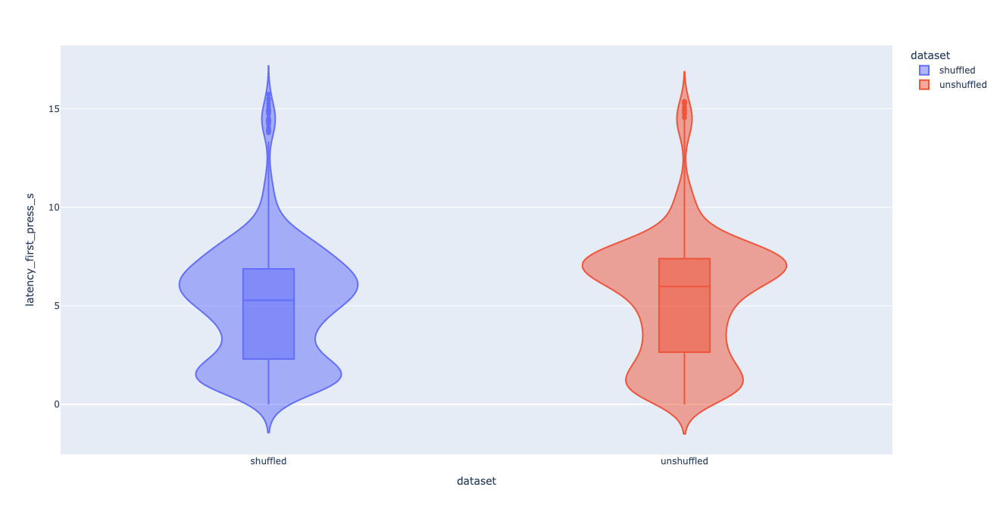](https://htmlpreview.github.io/?https://github.com/Shaadalam9/multiped-learning/blob/main/figures/compare_violin_latency_first_press_s.html)
Trial level distribution of the time to the first unsafe button press. Smaller values indicate faster commitment to an unsafe response.

[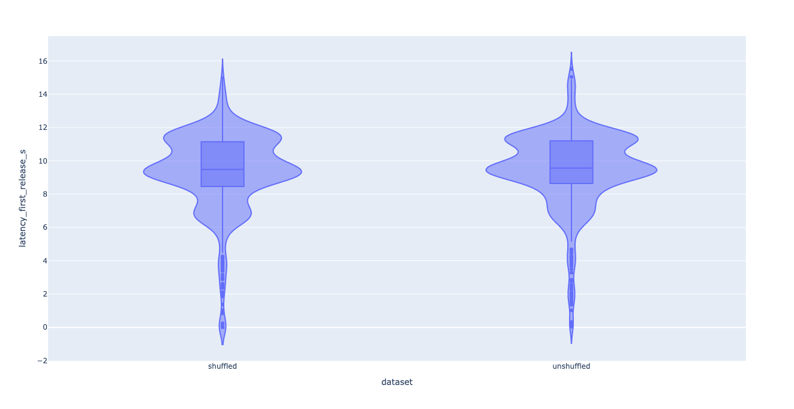](https://htmlpreview.github.io/?https://github.com/Shaadalam9/multiped-learning/blob/main/figures/compare_violin_latency_first_release_s.html)
Trial level distribution of the time to the first release from an unsafe button press. Smaller values indicate faster disengagement from the unsafe response.

[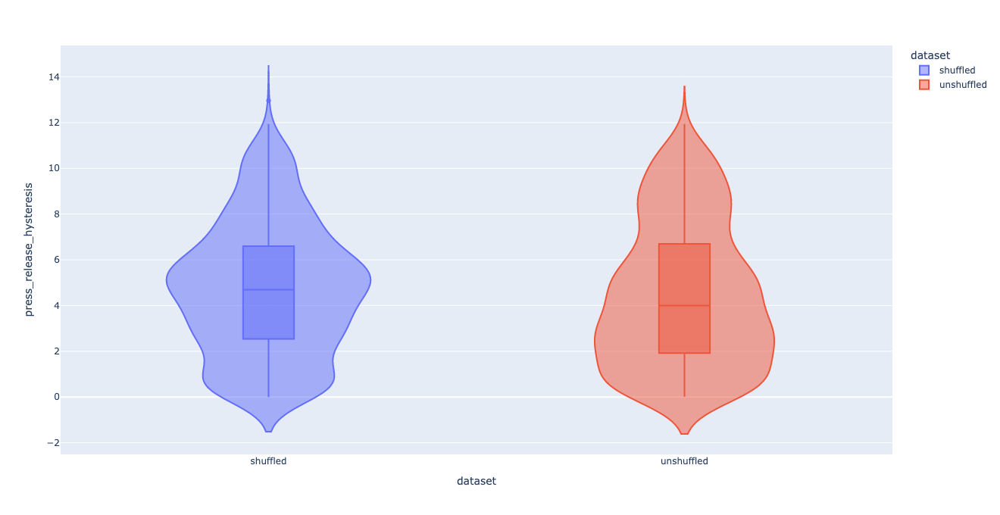](https://htmlpreview.github.io/?https://github.com/Shaadalam9/multiped-learning/blob/main/figures/compare_violin_press_release_hysteresis.html)
Trial level distribution of the interval between the first unsafe button press and the first release. Larger values indicate that an initial unsafe commitment was maintained for longer once initiated.

[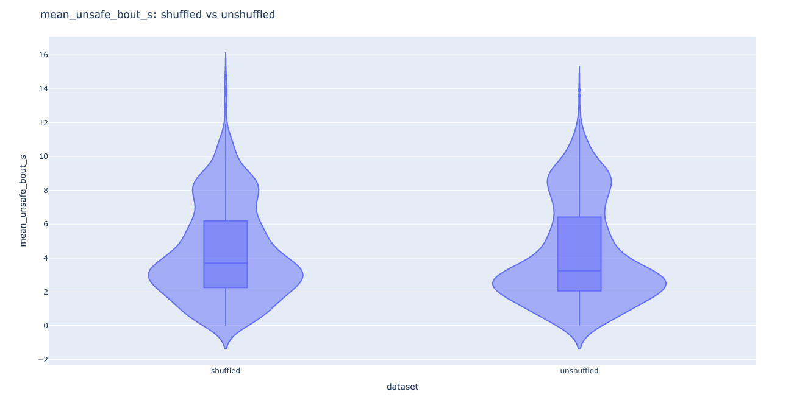](https://htmlpreview.github.io/?https://github.com/Shaadalam9/multiped-learning/blob/main/figures/compare_violin_mean_unsafe_bout_s.html)
Trial level distribution of the average duration of unsafe bouts within a trial.

[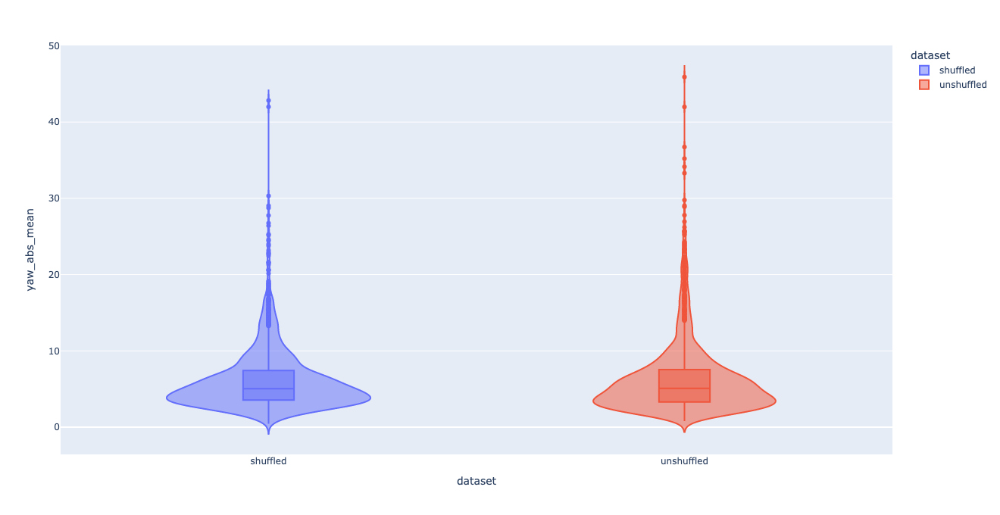](https://htmlpreview.github.io/?https://github.com/Shaadalam9/multiped-learning/blob/main/figures/compare_violin_yaw_abs_mean.html)
Trial level distribution of average absolute head yaw. Larger values indicate that participants looked further away from straight ahead on average.

[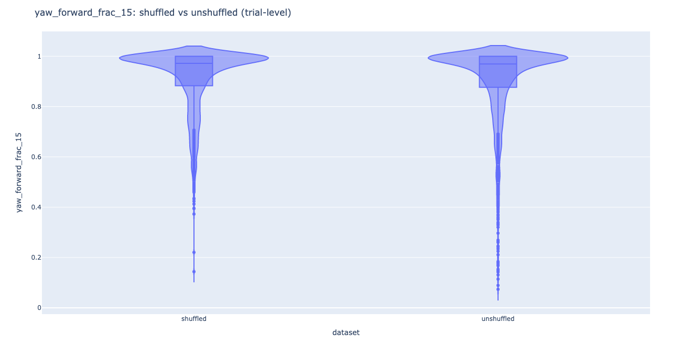](https://htmlpreview.github.io/?https://github.com/Shaadalam9/multiped-learning/blob/main/figures/compare_violin_yaw_forward_frac_15.html)
Trial level distribution of the fraction of time that head yaw remained within fifteen degrees of straight ahead.

[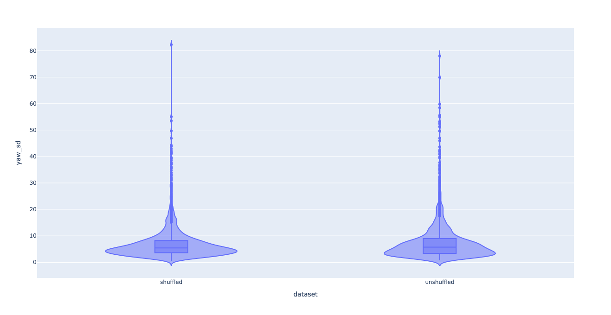](https://htmlpreview.github.io/?https://github.com/Shaadalam9/multiped-learning/blob/main/figures/compare_violin_yaw_sd.html)
Trial level distribution of head yaw variability. Larger values indicate more variable head orientation within the trial.

[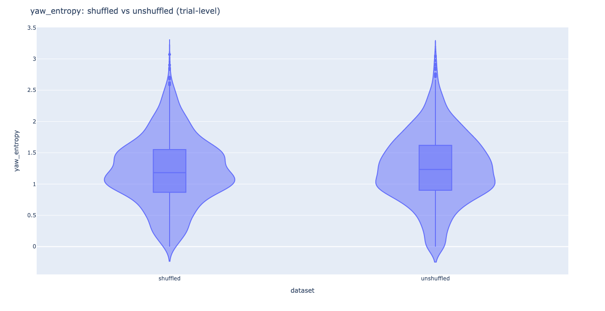](https://htmlpreview.github.io/?https://github.com/Shaadalam9/multiped-learning/blob/main/figures/compare_violin_yaw_entropy.html)
Trial level distribution of the entropy of head yaw. Larger values indicate less stereotyped visual scanning patterns.

[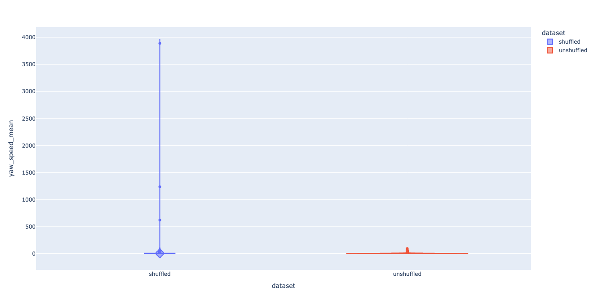](https://htmlpreview.github.io/?https://github.com/Shaadalam9/multiped-learning/blob/main/figures/compare_violin_yaw_speed_mean.html)
Trial level distribution of average head turning speed.

[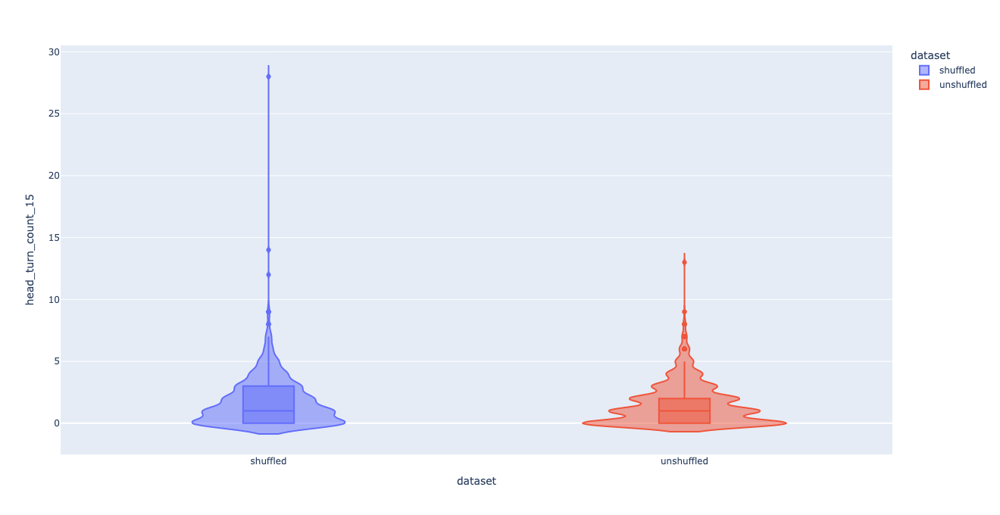](https://htmlpreview.github.io/?https://github.com/Shaadalam9/multiped-learning/blob/main/figures/compare_violin_head_turn_count_15.html)
Trial level distribution of the number of head turns crossing the fifteen degree threshold.

[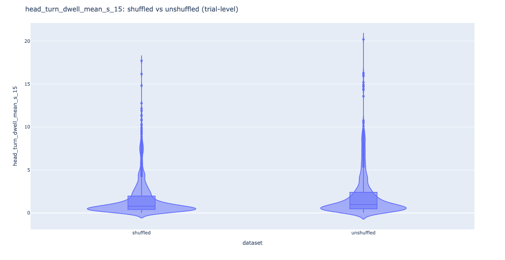](https://htmlpreview.github.io/?https://github.com/Shaadalam9/multiped-learning/blob/main/figures/compare_violin_head_turn_dwell_mean_s_15.html)
Trial level distribution of the average time spent in head turn states beyond fifteen degrees.

[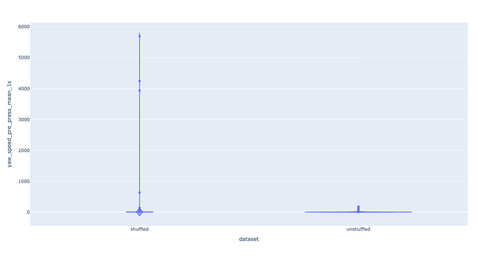](https://htmlpreview.github.io/?https://github.com/Shaadalam9/multiped-learning/blob/main/figures/compare_violin_yaw_speed_pre_press_mean_1s.html)
Trial level distribution of average head yaw speed during the one second window before the first unsafe button press.

[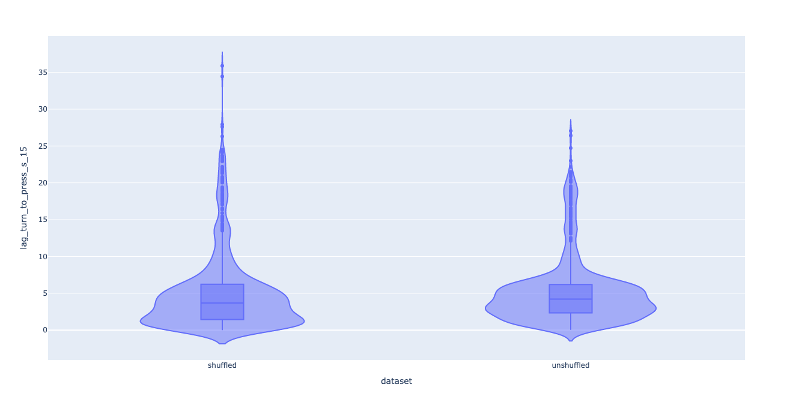](https://htmlpreview.github.io/?https://github.com/Shaadalam9/multiped-learning/blob/main/figures/compare_violin_lag_turn_to_press_s_15.html)
Trial level distribution of the delay between a threshold crossing head turn and the first unsafe button press.

[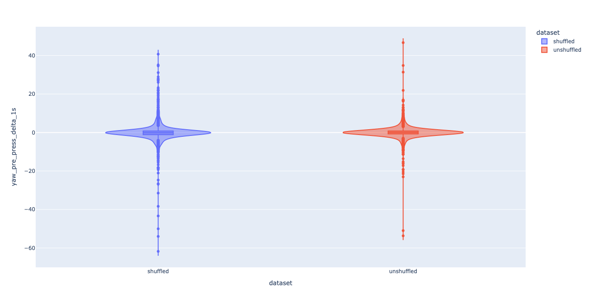](https://htmlpreview.github.io/?https://github.com/Shaadalam9/multiped-learning/blob/main/figures/compare_violin_yaw_pre_press_delta_1s.html)
Trial level distribution of net head yaw change during the one second window before the first unsafe button press.

[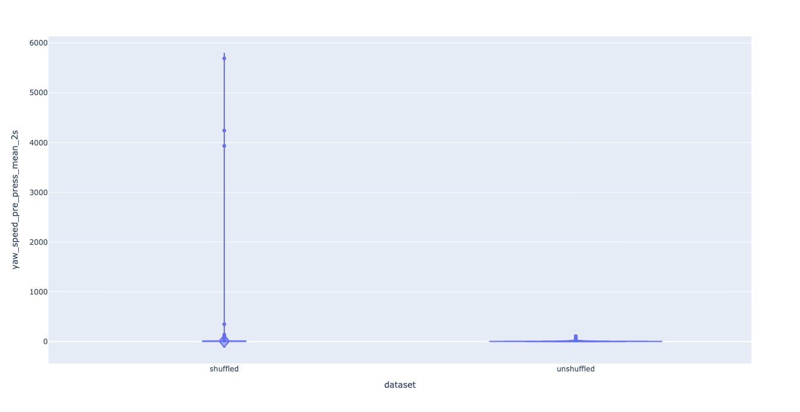](https://htmlpreview.github.io/?https://github.com/Shaadalam9/multiped-learning/blob/main/figures/compare_violin_yaw_speed_pre_press_mean_2s.html)
Trial level distribution of average head yaw speed during the two second window before the first unsafe button press.

[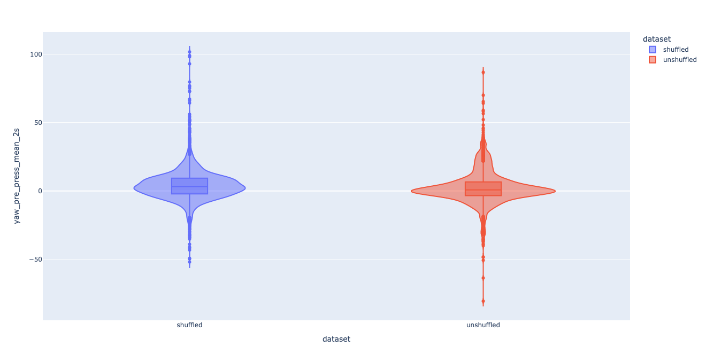](https://htmlpreview.github.io/?https://github.com/Shaadalam9/multiped-learning/blob/main/figures/compare_violin_yaw_pre_press_mean_2s.html)
Trial level distribution of mean head yaw during the two second window before the first unsafe button press.

[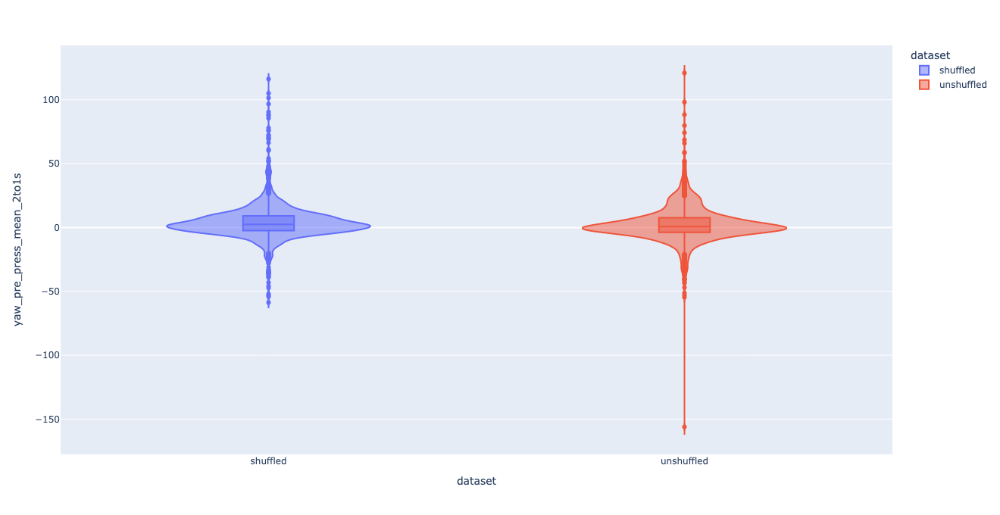](https://htmlpreview.github.io/?https://github.com/Shaadalam9/multiped-learning/blob/main/figures/compare_violin_yaw_pre_press_mean_2to1s.html)
Trial level distribution of mean head yaw during the earlier pre press window from two to one seconds before the first unsafe button press.

[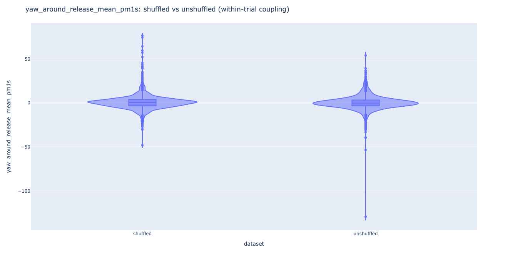](https://htmlpreview.github.io/?https://github.com/Shaadalam9/multiped-learning/blob/main/figures/compare_violin_yaw_around_release_mean_pm1s.html)
Trial level distribution of mean head yaw in the one second window before and after the first unsafe button release.

[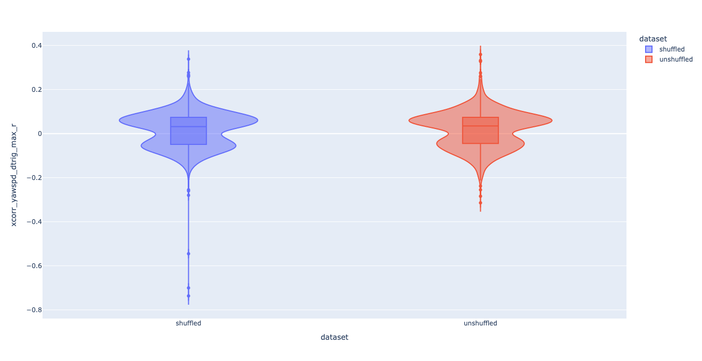](https://htmlpreview.github.io/?https://github.com/Shaadalam9/multiped-learning/blob/main/figures/compare_violin_xcorr_yawspd_dtrig_max_r.html)
Trial level distribution of the strongest cross correlation between head yaw speed and the first derivative of the trigger signal within a trial.

[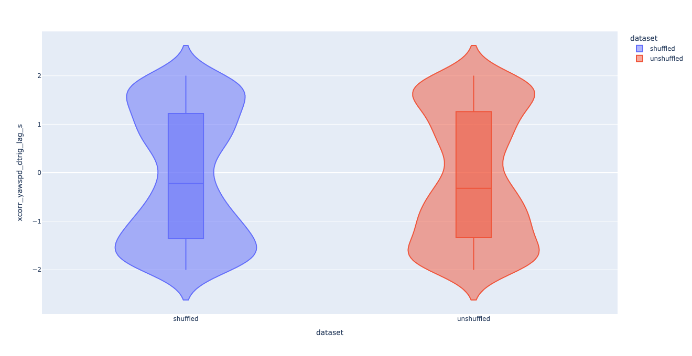](https://htmlpreview.github.io/?https://github.com/Shaadalam9/multiped-learning/blob/main/figures/compare_violin_xcorr_yawspd_dtrig_lag_s.html)
Trial level distribution of the lag at which the cross correlation between head yaw speed and the first derivative of the trigger signal is strongest.

[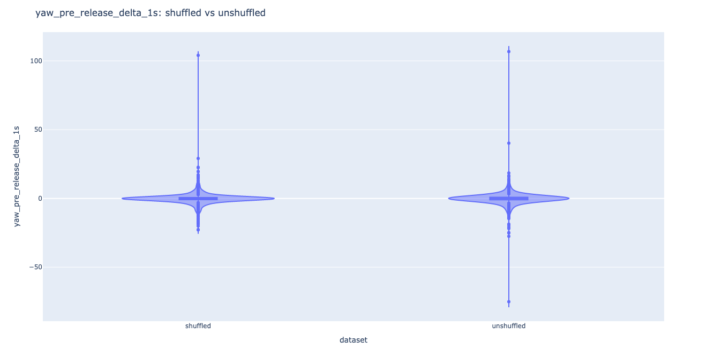](https://htmlpreview.github.io/?https://github.com/Shaadalam9/multiped-learning/blob/main/figures/compare_violin_yaw_pre_release_delta_1s.html)
Trial level distribution of net head yaw change during the one second window before the first unsafe button release.

[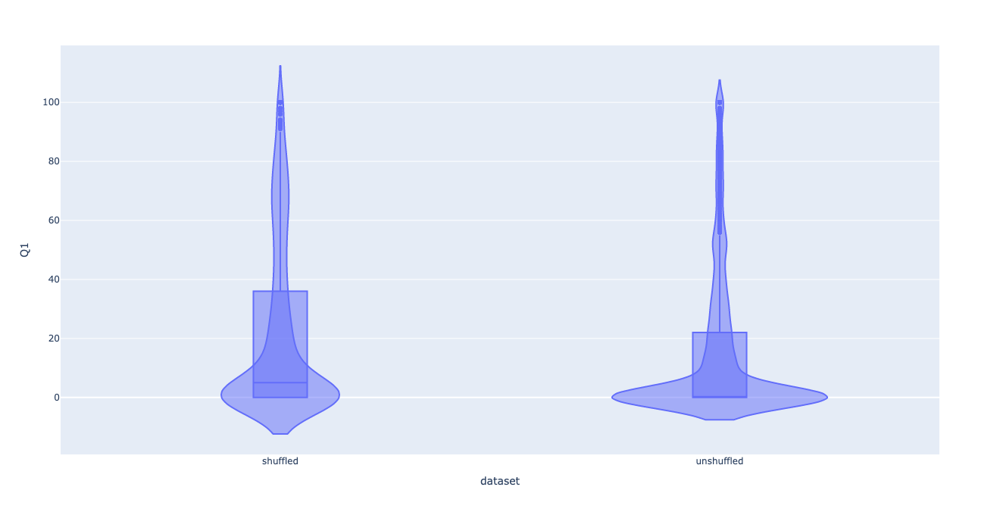](https://htmlpreview.github.io/?https://github.com/Shaadalam9/multiped-learning/blob/main/figures/compare_violin_Q1.html)
Trial level distribution of Q1 ratings across the randomised and fixed order datasets.

[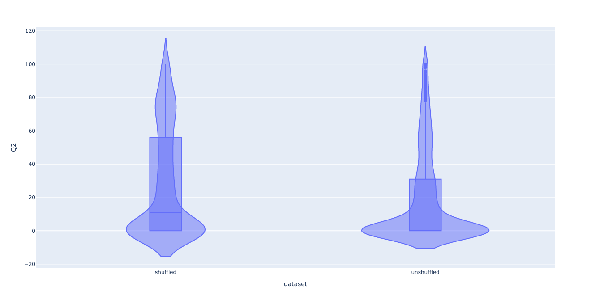](https://htmlpreview.github.io/?https://github.com/Shaadalam9/multiped-learning/blob/main/figures/compare_violin_Q2.html)
Trial level distribution of Q2 ratings across the randomised and fixed order datasets.

[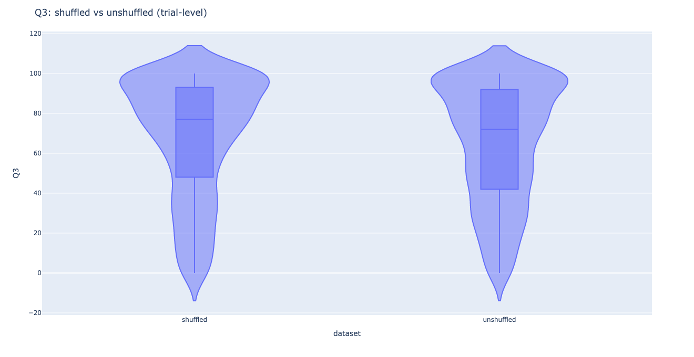](https://htmlpreview.github.io/?https://github.com/Shaadalam9/multiped-learning/blob/main/figures/compare_violin_Q3.html)
Trial level distribution of Q3 ratings across the randomised and fixed order datasets.

[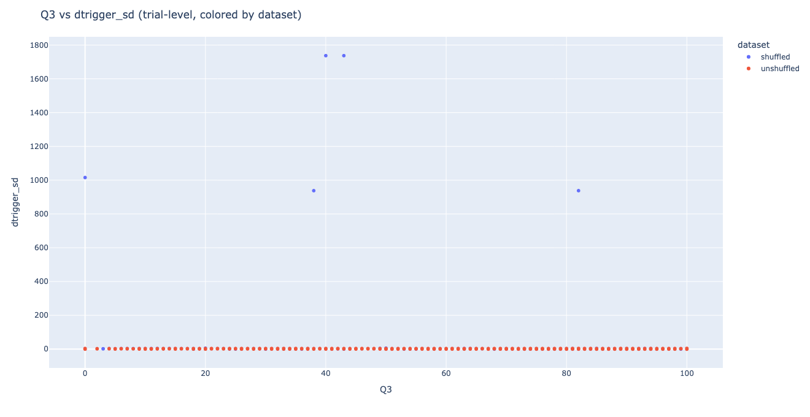](https://htmlpreview.github.io/?https://github.com/Shaadalam9/multiped-learning/blob/main/figures/scatter_Q3_vs_dtrigger_sd.html)
Trial level association between Q3 ratings and unsafety volatility. The figure shows whether higher subjective ratings are aligned with more variable continuous unsafety responses.

[](https://htmlpreview.github.io/?https://github.com/Shaadalam9/multiped-learning/blob/main/figures/scatter_Q3_vs_trigger_sd.html)
Trial level association between Q3 ratings and unsafety volatility. Use this entry if your exported file uses trigger_sd rather than dtrigger_sd in the filename.

[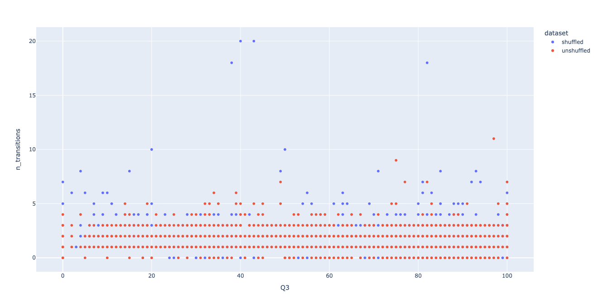](https://htmlpreview.github.io/?https://github.com/Shaadalam9/multiped-learning/blob/main/figures/scatter_Q3_vs_n_transitions.html)
Trial level association between Q3 ratings and the number of transitions in the trigger signal.

[](https://htmlpreview.github.io/?https://github.com/Shaadalam9/multiped-learning/blob/main/figures/scatter_Q3_vs_transitions.html)
Trial level association between Q3 ratings and the number of transitions in the trigger signal. Use this entry if your exported file uses transitions rather than n_transitions in the filename.

[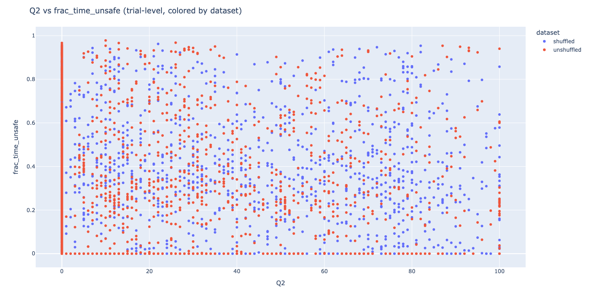](https://htmlpreview.github.io/?https://github.com/Shaadalam9/multiped-learning/blob/main/figures/scatter_Q2_vs_frac_time_unsafe.html)
Trial level association between Q2 ratings and the fraction of trial time spent in the unsafe zone.

[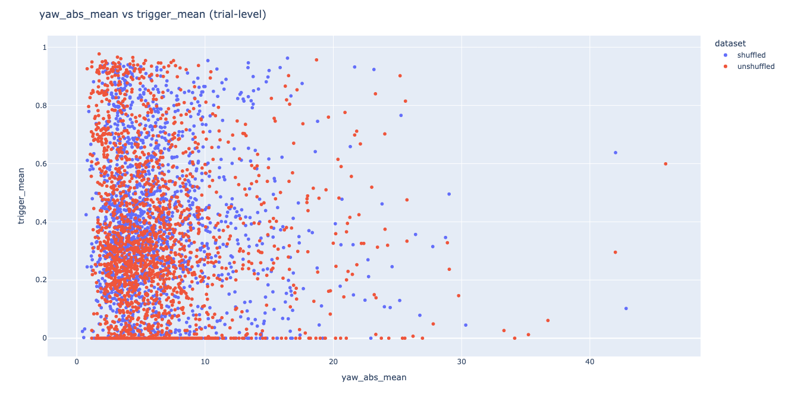](https://htmlpreview.github.io/?https://github.com/Shaadalam9/multiped-learning/blob/main/figures/scatter_yaw_abs_mean_vs_trigger_mean.html)
Trial level association between average absolute head yaw and average continuous unsafety.

[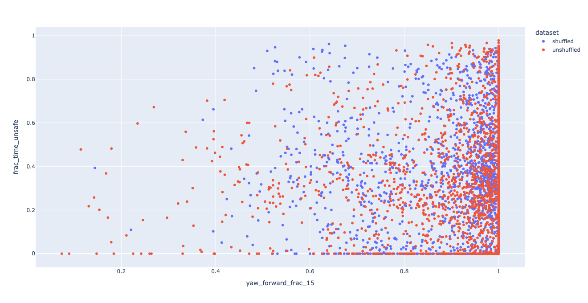](https://htmlpreview.github.io/?https://github.com/Shaadalam9/multiped-learning/blob/main/figures/scatter_yaw_forward_frac_15_vs_frac_time_unsafe.html)
Trial level association between the fraction of time looking forward within fifteen degrees and the fraction of time spent in the unsafe zone.

[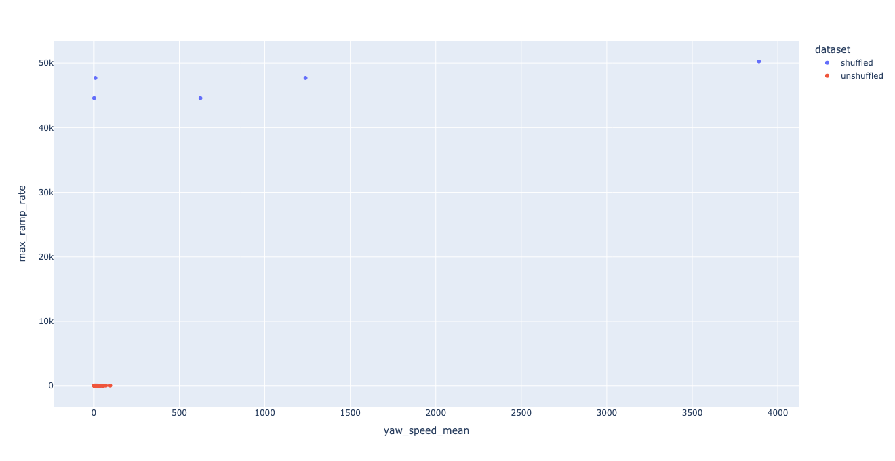](https://htmlpreview.github.io/?https://github.com/Shaadalam9/multiped-learning/blob/main/figures/scatter_yaw_speed_mean_vs_max_ramp_rate.html)
Trial level association between average head turning speed and the steepest increase in the trigger signal.

[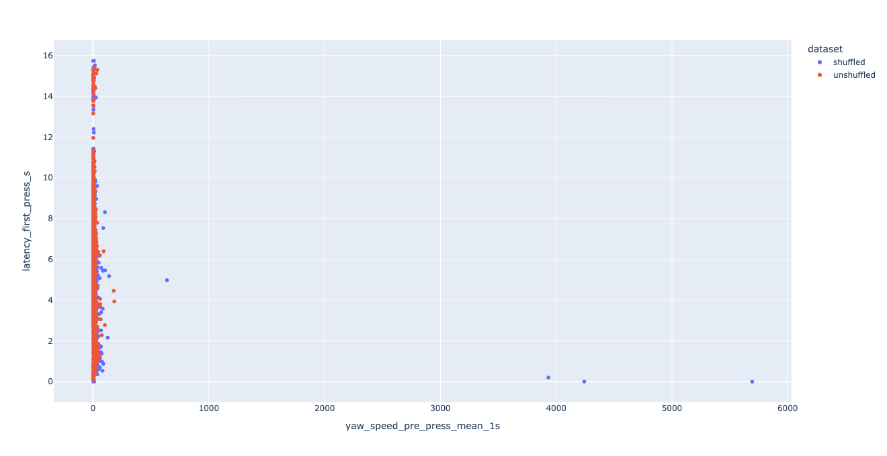](https://htmlpreview.github.io/?https://github.com/Shaadalam9/multiped-learning/blob/main/figures/scatter_yaw_speed_pre_press_mean_1s_vs_latency_first_press_s.html)
Trial level association between average head yaw speed in the one second before first press and the latency to the first unsafe press.

[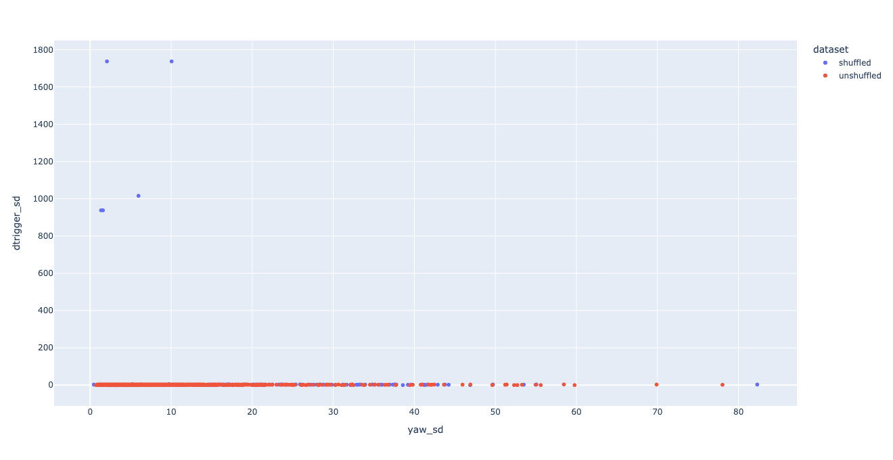](https://htmlpreview.github.io/?https://github.com/Shaadalam9/multiped-learning/blob/main/figures/scatter_yaw_sd_vs_dtrigger_sd.html)
Trial level coupling between head yaw variability and volatility of the continuous unsafety signal.

[](https://htmlpreview.github.io/?https://github.com/Shaadalam9/multiped-learning/blob/main/figures/scatter_yaw_sd_vs_trigger_sd.html)
Trial level coupling between head yaw variability and volatility of the continuous unsafety signal. Use this entry if your exported file uses trigger_sd rather than dtrigger_sd in the filename.

[](https://htmlpreview.github.io/?https://github.com/Shaadalam9/multiped-learning/blob/main/figures/scatter_yaw_forward_frac_15_vs_Q3.html)
Trial level association between the fraction of time looking forward within fifteen degrees and Q3 ratings.

[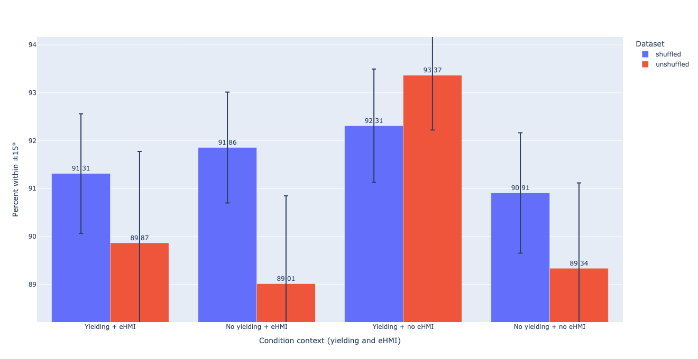](https://htmlpreview.github.io/?https://github.com/Shaadalam9/multiped-learning/blob/main/figures/yaw_forward_fraction_by_context.html)
Head orientation summary by experimental context. The figure shows how the proportion of forward looking behaviour varies across condition combinations.

[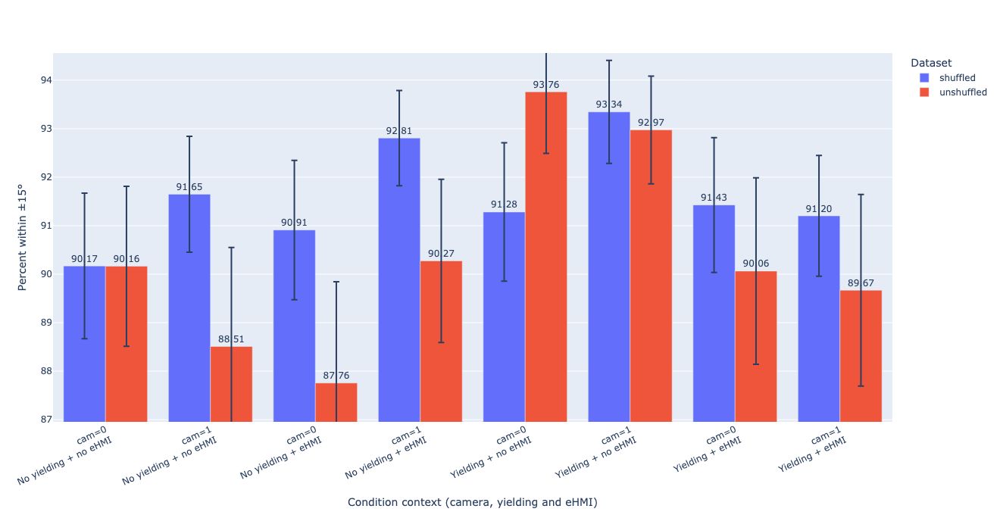](https://htmlpreview.github.io/?https://github.com/Shaadalam9/multiped-learning/blob/main/figures/yaw_forward_fraction_by_context_camera.html)
Head orientation summary by experimental context with an explicit camera or visibility breakdown.

[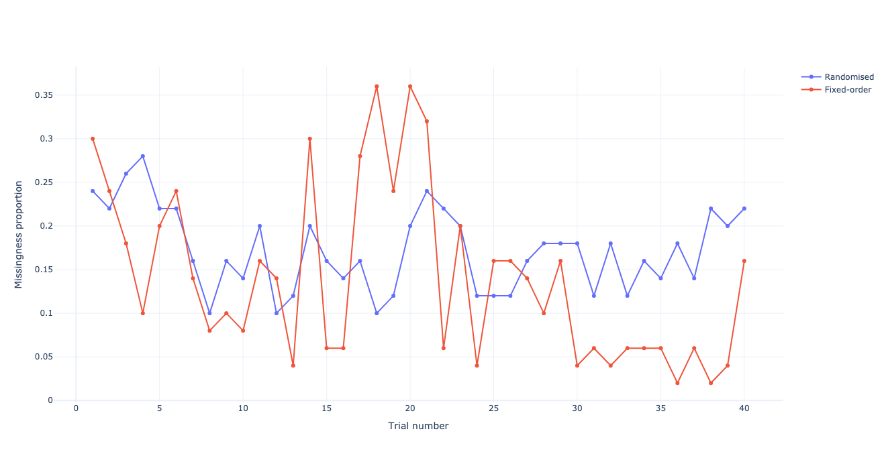](https://htmlpreview.github.io/?https://github.com/Shaadalam9/multiped-learning/blob/main/figures/missingness_press_over_trial.html)
Curves show the mean probability of missing first press latency across participants at each trial position for the randomised and fixed order datasets. Shaded bands indicate ninety five percent confidence intervals.

[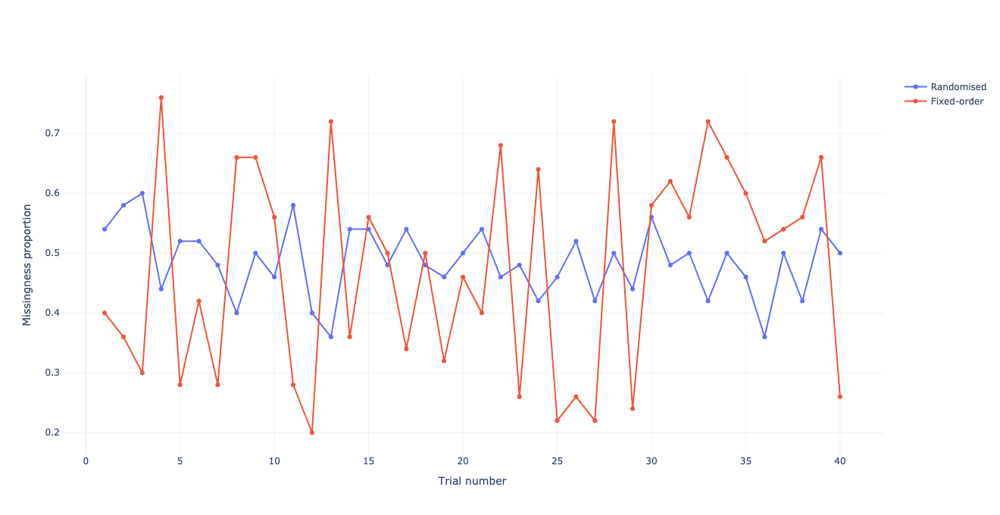](https://htmlpreview.github.io/?https://github.com/Shaadalam9/multiped-learning/blob/main/figures/missingness_release_over_trial.html)
Curves show the mean probability of missing first release latency across participants at each trial position for the randomised and fixed order datasets. Shaded bands indicate ninety five percent confidence intervals.

[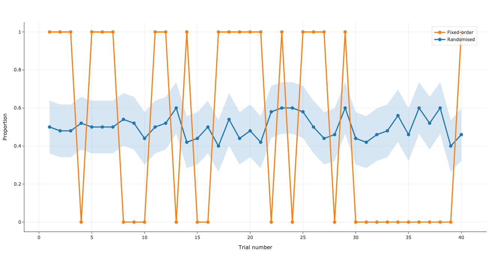](https://htmlpreview.github.io/?https://github.com/Shaadalam9/multiped-learning/blob/main/figures/factor_drift_yielding_over_trial_index.html)
Average trial composition by trial position across participants for the yielding factor. For each trial position, the curves show the proportion of participants who encountered a yielding trial.

[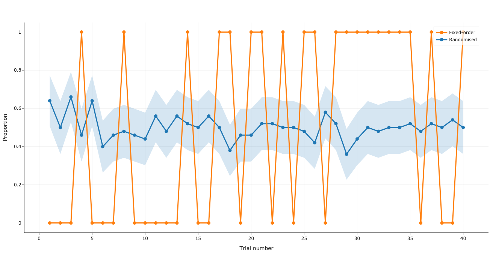](https://htmlpreview.github.io/?https://github.com/Shaadalam9/multiped-learning/blob/main/figures/factor_drift_eHMIOn_over_trial_index.html)
Average trial composition by trial position across participants for the eHMI factor. For each trial position, the curves show the proportion of participants who encountered an eHMI on trial.

[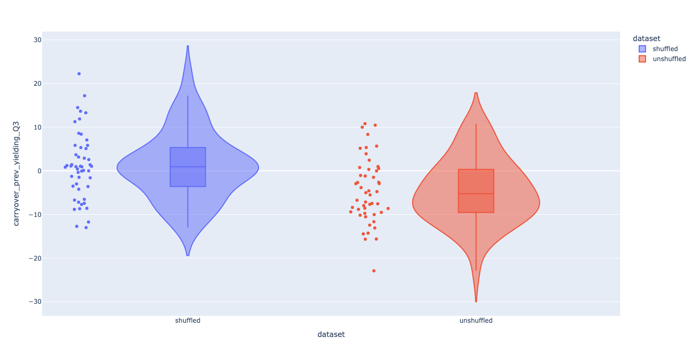](https://htmlpreview.github.io/?https://github.com/Shaadalam9/multiped-learning/blob/main/figures/compare_participant_violin_E_carryover_Q3.html)
Participant level carryover of previous trial yielding on Q3 ratings.

[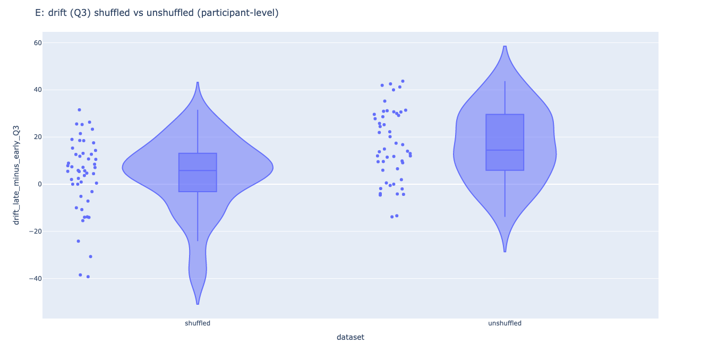](https://htmlpreview.github.io/?https://github.com/Shaadalam9/multiped-learning/blob/main/figures/compare_participant_violin_E_drift_Q3.html)
Participant level early to late drift in Q3 ratings. Positive values indicate higher Q3 ratings later in the session than earlier in the session.

[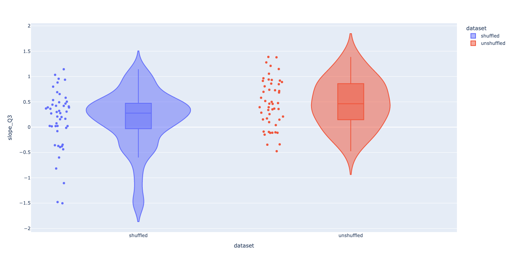](https://htmlpreview.github.io/?https://github.com/Shaadalam9/multiped-learning/blob/main/figures/compare_participant_violin_E_slope_Q3.html)
Participant level linear slope of Q3 over trial position.

[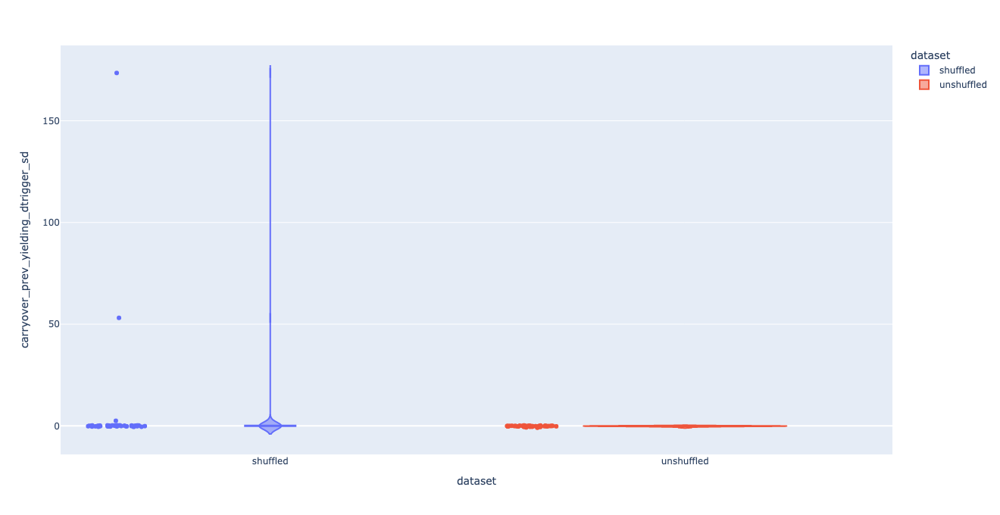](https://htmlpreview.github.io/?https://github.com/Shaadalam9/multiped-learning/blob/main/figures/compare_participant_violin_E_carryover_dtrigger_sd.html)
Participant level carryover of previous trial yielding on unsafety volatility.

[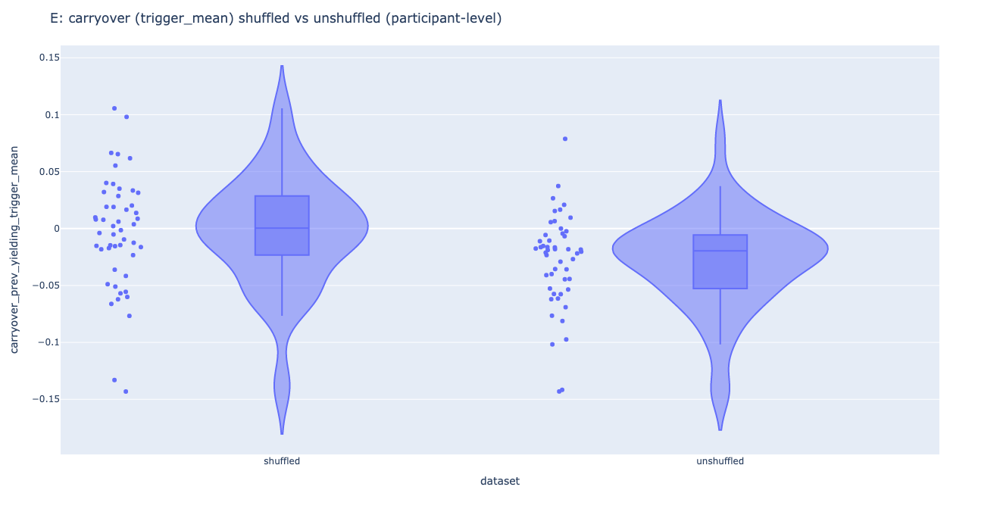](https://htmlpreview.github.io/?https://github.com/Shaadalam9/multiped-learning/blob/main/figures/compare_participant_violin_E_carryover_trigger_mean.html)
Participant level carryover of previous trial yielding on mean continuous unsafety.

[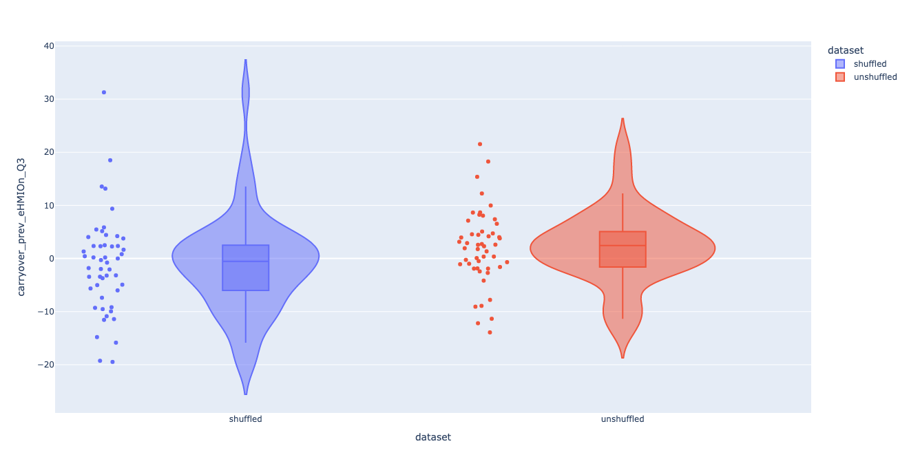](https://htmlpreview.github.io/?https://github.com/Shaadalam9/multiped-learning/blob/main/figures/compare_participant_violin_E_carryover_prev_eHMIOn_Q3.html)
Participant level carryover of previous trial eHMI status on Q3 ratings.

[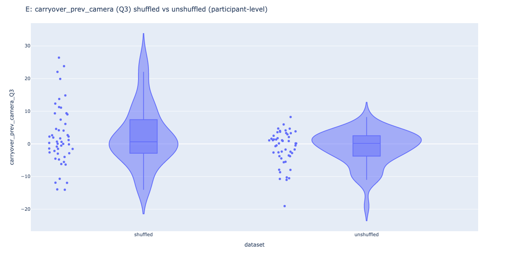](https://htmlpreview.github.io/?https://github.com/Shaadalam9/multiped-learning/blob/main/figures/compare_participant_violin_E_carryover_prev_camera_Q3.html)
Participant level carryover of previous trial camera or visibility condition on Q3 ratings.

[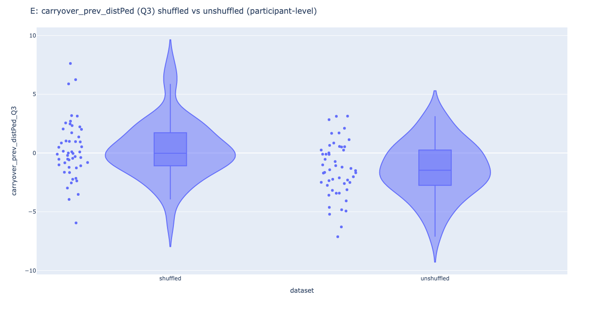](https://htmlpreview.github.io/?https://github.com/Shaadalam9/multiped-learning/blob/main/figures/compare_participant_violin_E_carryover_prev_distPed_Q3.html)
Participant level carryover of previous trial pedestrian distance on Q3 ratings.

[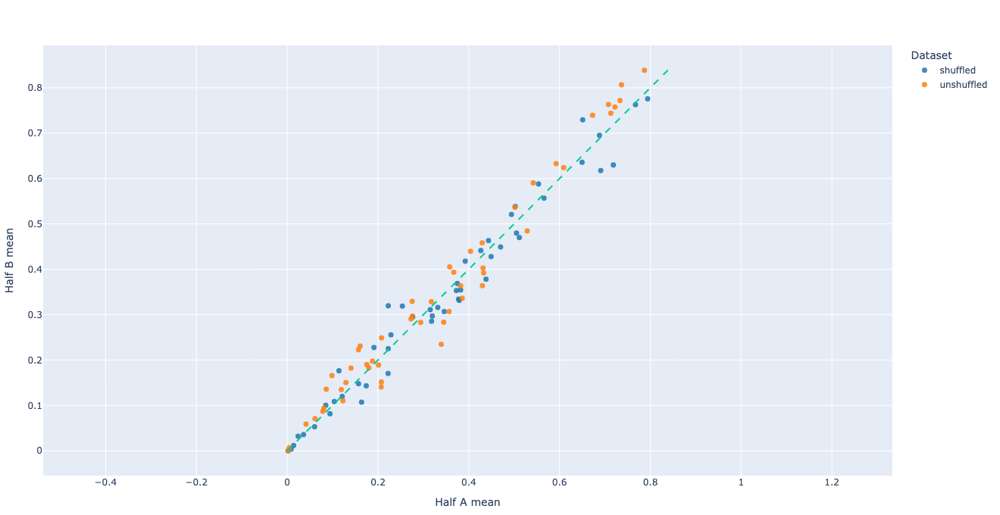](https://htmlpreview.github.io/?https://github.com/Shaadalam9/multiped-learning/blob/main/figures/reliability_trigger_mean_odd_even.html)
Within participant reliability of mean continuous unsafety for odd and even trial splits.

[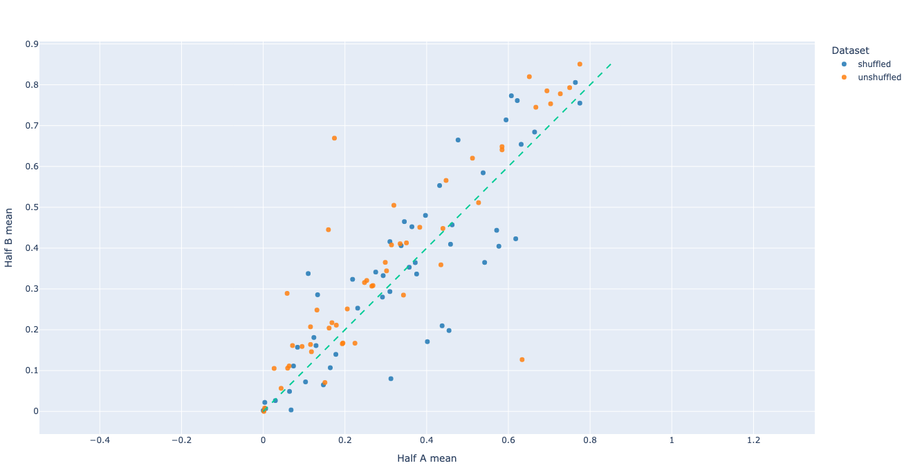](https://htmlpreview.github.io/?https://github.com/Shaadalam9/multiped-learning/blob/main/figures/reliability_trigger_mean_early_late.html)
Within participant reliability of mean continuous unsafety for early and late trial halves.

[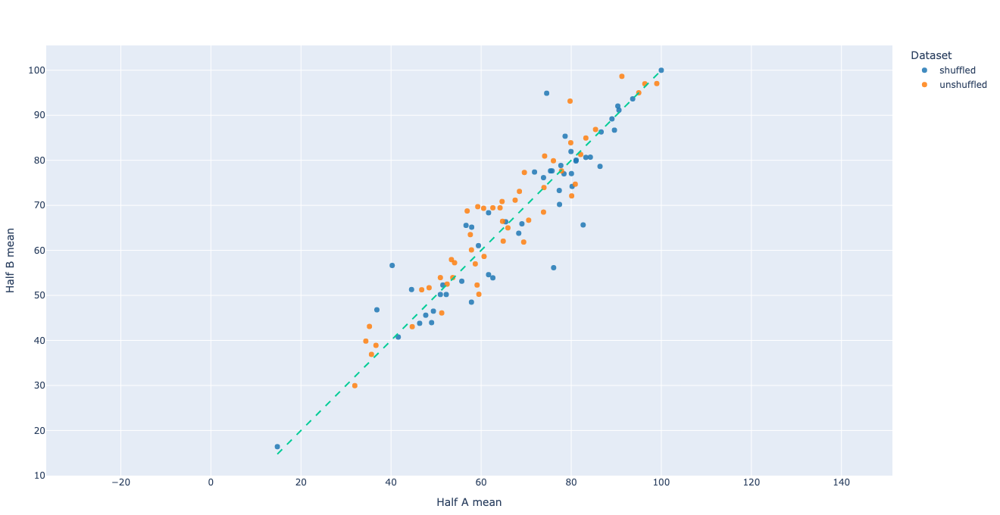](https://htmlpreview.github.io/?https://github.com/Shaadalam9/multiped-learning/blob/main/figures/reliability_Q3_odd_even.html)
Within participant reliability of Q3 ratings for odd and even trial splits.

[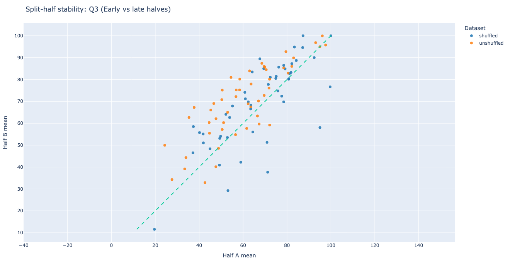](https://htmlpreview.github.io/?https://github.com/Shaadalam9/multiped-learning/blob/main/figures/reliability_Q3_early_late.html)
Within participant reliability of Q3 ratings for early and late trial halves.

[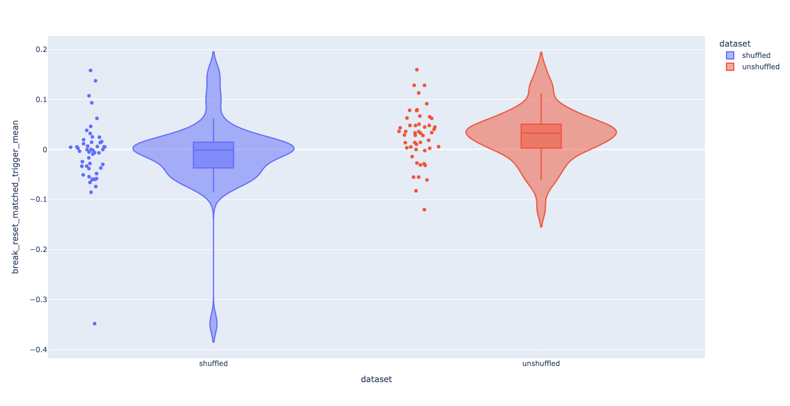](https://htmlpreview.github.io/?https://github.com/Shaadalam9/multiped-learning/blob/main/figures/compare_participant_violin_breakmatched_trigger_mean.html)
Participant level comparison of mean continuous unsafety using break aligned trial segments.

[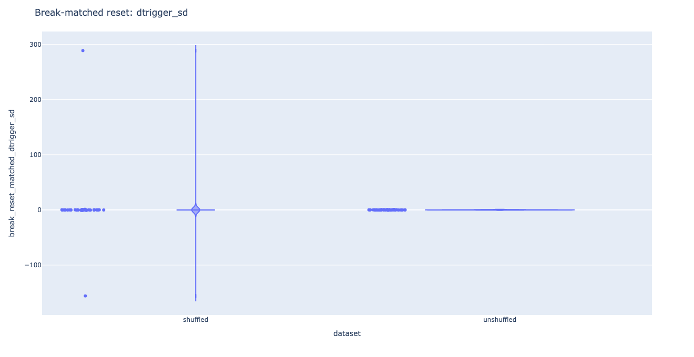](https://htmlpreview.github.io/?https://github.com/Shaadalam9/multiped-learning/blob/main/figures/compare_participant_violin_breakmatched_dtrigger_sd.html)
Participant level comparison of unsafety volatility using break aligned trial segments.

[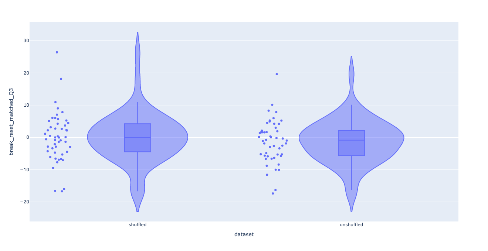](https://htmlpreview.github.io/?https://github.com/Shaadalam9/multiped-learning/blob/main/figures/compare_participant_violin_breakmatched_Q3.html)
Participant level comparison of Q3 ratings using break aligned trial segments.

[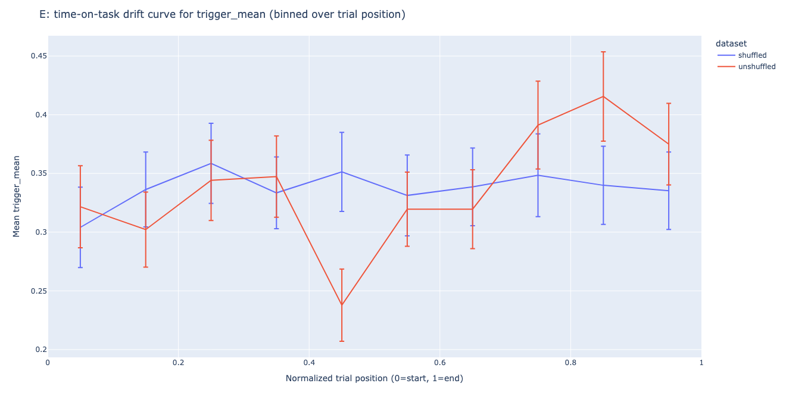](https://htmlpreview.github.io/?https://github.com/Shaadalam9/multiped-learning/blob/main/figures/curve_time_on_task_trigger_mean.html)
Descriptive time on task curve for mean continuous unsafety over trial position by dataset.

[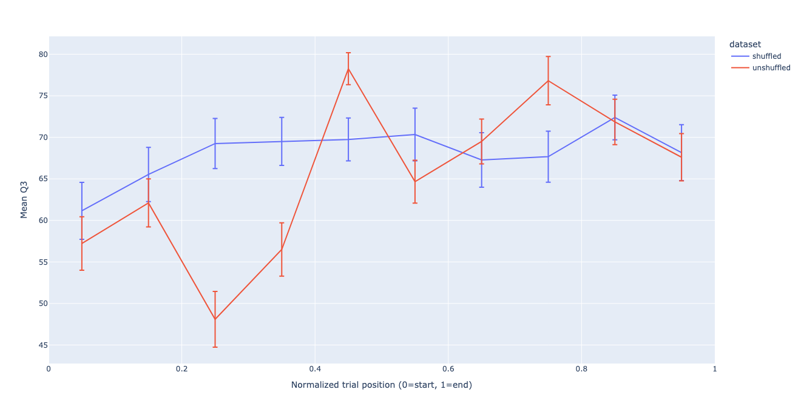](https://htmlpreview.github.io/?https://github.com/Shaadalam9/multiped-learning/blob/main/figures/curve_time_on_task_Q3.html)
Descriptive time on task curve for Q3 over trial position by dataset.

[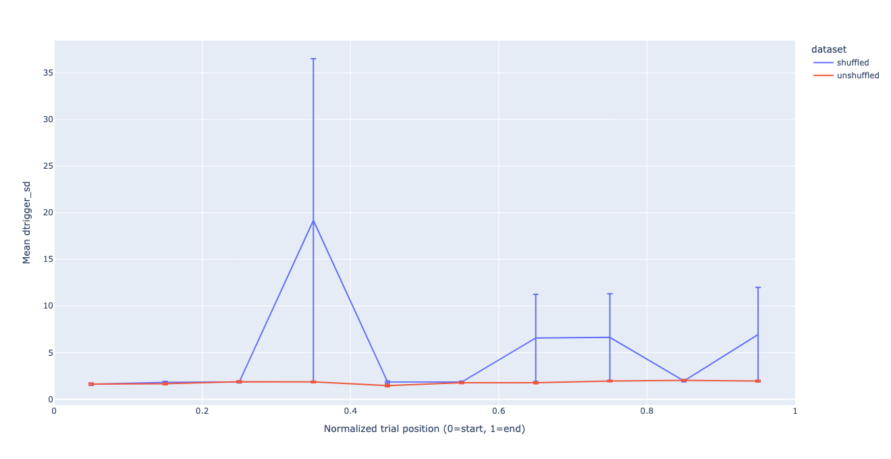](https://htmlpreview.github.io/?https://github.com/Shaadalam9/multiped-learning/blob/main/figures/curve_time_on_task_dtrigger_sd.html)
Descriptive time on task curve for unsafety volatility over trial position by dataset.

[](https://htmlpreview.github.io/?https://github.com/Shaadalam9/multiped-learning/blob/main/figures/MM5_curve_Q3_exposure_yielding.html)
Exposure based learning curve for Q3 as a function of cumulative yielding exposure.

[](https://htmlpreview.github.io/?https://github.com/Shaadalam9/multiped-learning/blob/main/figures/MM5_curve_Q3_exposure_eHMI.html)
Exposure based learning curve for Q3 as a function of cumulative eHMI exposure.

[](https://htmlpreview.github.io/?https://github.com/Shaadalam9/multiped-learning/blob/main/figures/MM5_forest_exposure_interactions.html)
Forest summary of exposure interaction effects from the mixed effects models.

[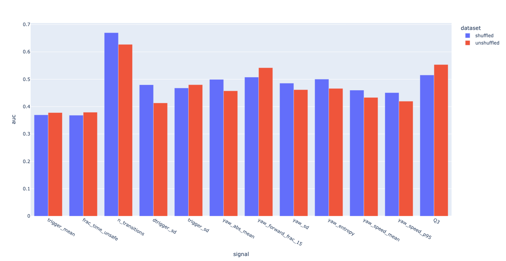](https://htmlpreview.github.io/?https://github.com/Shaadalam9/multiped-learning/blob/main/figures/F2_bar_auc_by_signal.html)
ROC AUC by signal and dataset for discriminating yielding versus non yielding trials. The dashed reference line indicates chance performance at AUC equals zero point five.

[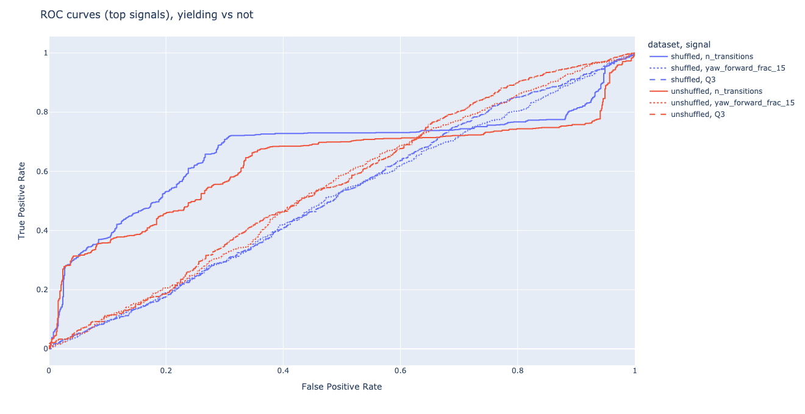](https://htmlpreview.github.io/?https://github.com/Shaadalam9/multiped-learning/blob/main/figures/F2_roc_curves_top_signals.html)
Receiver operating characteristic curves for the strongest yielding versus non yielding signals, shown separately by dataset.

[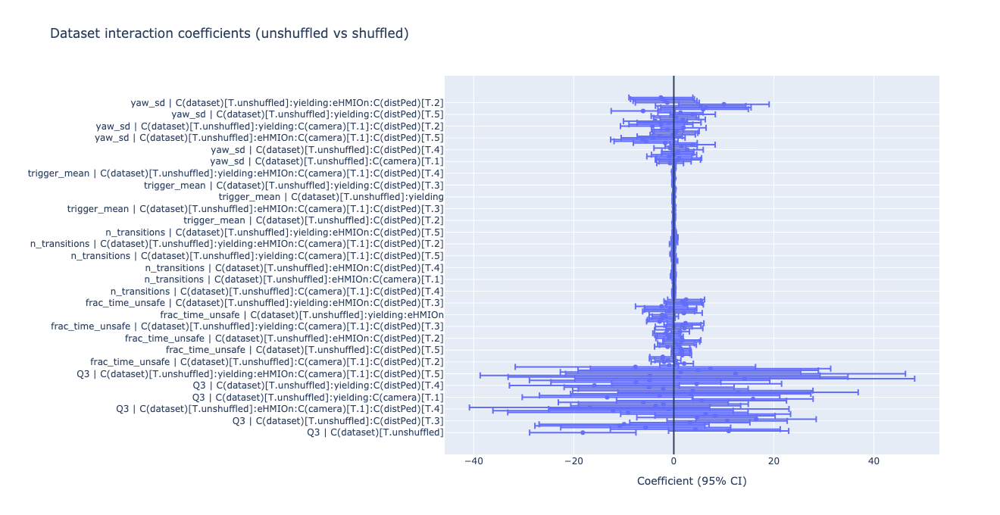](https://htmlpreview.github.io/?https://github.com/Shaadalam9/multiped-learning/blob/main/figures/MM1_forest_dataset_interactions.html)
Forest plot of dataset by condition interaction coefficients from the primary mixed effects models.

[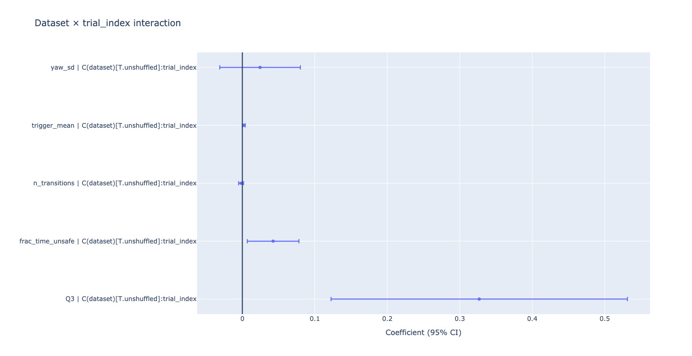](https://htmlpreview.github.io/?https://github.com/Shaadalam9/multiped-learning/blob/main/figures/MM2_forest_dataset_trial.html)
Forest plot of dataset by trial position interaction coefficients from the learning models.

[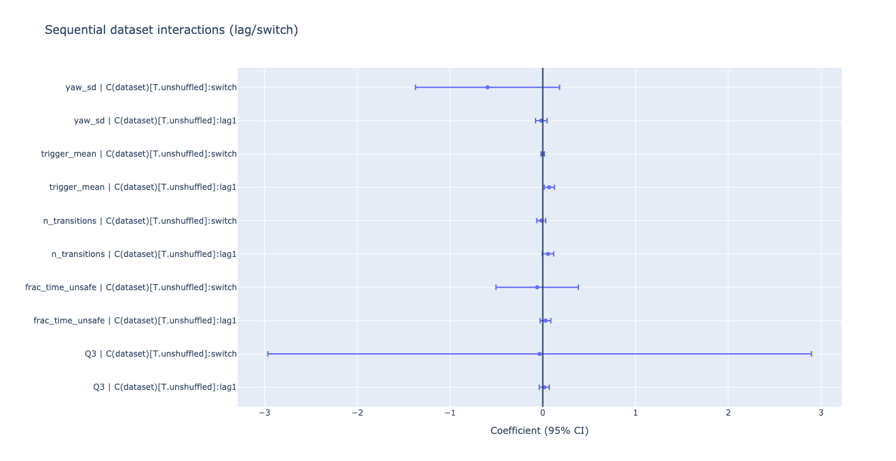](https://htmlpreview.github.io/?https://github.com/Shaadalam9/multiped-learning/blob/main/figures/MM3_forest_sequential.html)
Forest plot of dataset interactions for lag and switch terms in the sequential models.

[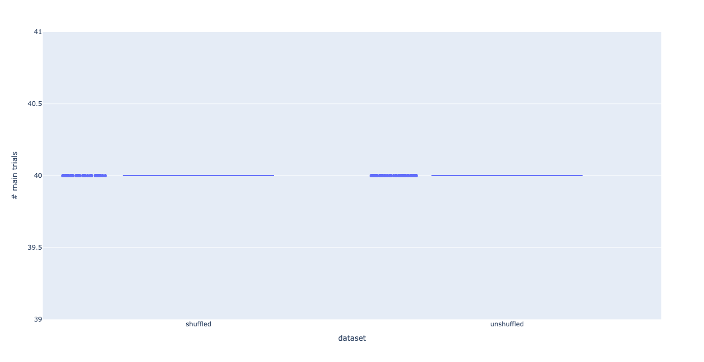](https://htmlpreview.github.io/?https://github.com/Shaadalam9/multiped-learning/blob/main/figures/between_subject_trial_completion_violin.html)
Participant level distribution of the number of completed main trials by dataset.

[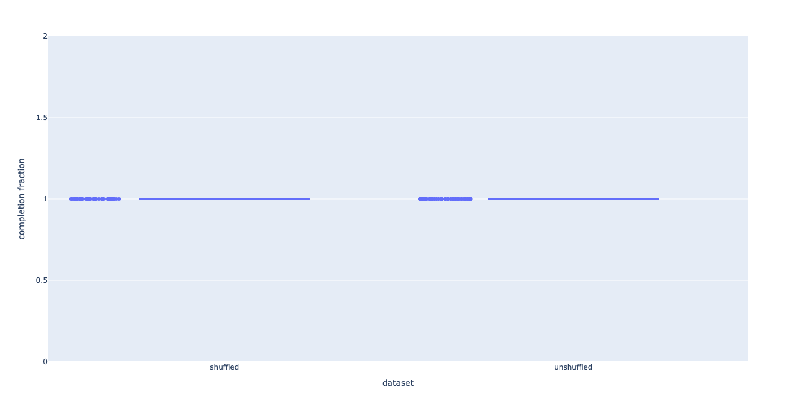](https://htmlpreview.github.io/?https://github.com/Shaadalam9/multiped-learning/blob/main/figures/between_subject_completion_fraction_violin.html)
Participant level distribution of completion fraction relative to the dataset median number of main trials.

[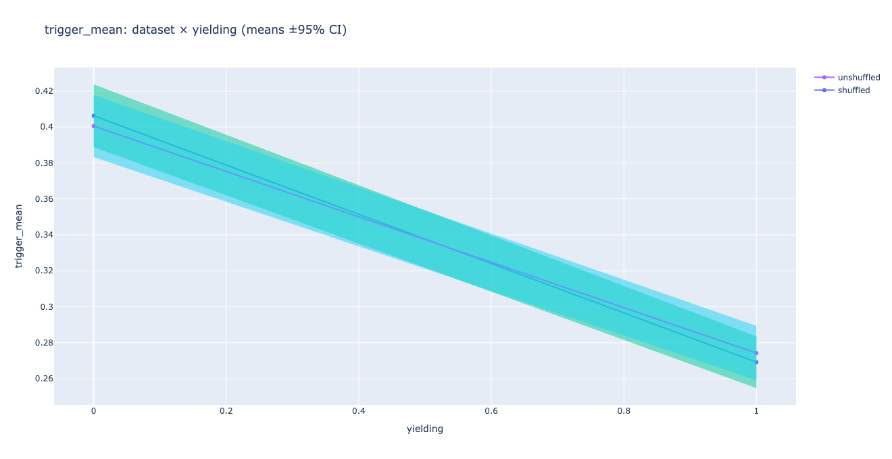](https://htmlpreview.github.io/?https://github.com/Shaadalam9/multiped-learning/blob/main/figures/MM1_means_trigger_mean_dataset_yielding.html)
Descriptive means plot for mean continuous unsafety by dataset and yielding condition.

[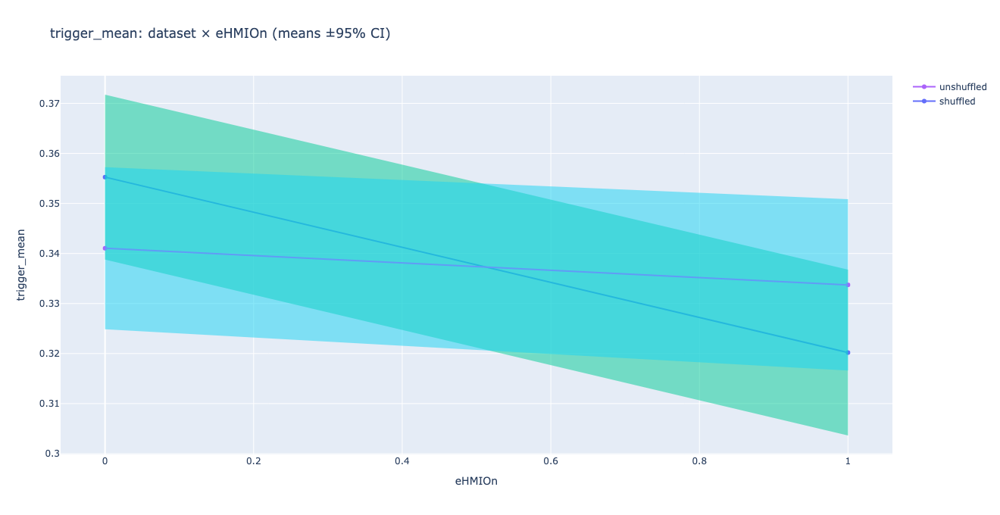](https://htmlpreview.github.io/?https://github.com/Shaadalam9/multiped-learning/blob/main/figures/MM1_means_trigger_mean_dataset_eHMIOn.html)
Descriptive means plot for mean continuous unsafety by dataset and eHMI condition.

[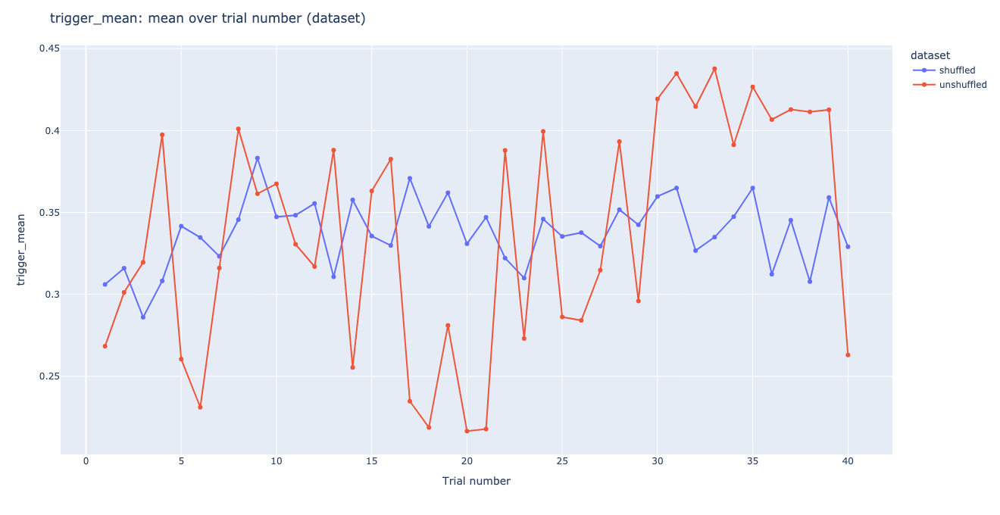](https://htmlpreview.github.io/?https://github.com/Shaadalam9/multiped-learning/blob/main/figures/MM2_curve_trigger_mean_over_trial_index.html)
Mean trajectory of mean continuous unsafety over trial position by dataset, shown as a descriptive companion to the mixed effects learning model.

[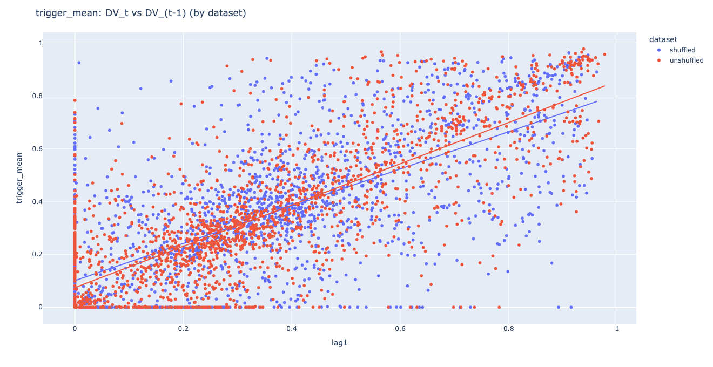](https://htmlpreview.github.io/?https://github.com/Shaadalam9/multiped-learning/blob/main/figures/MM3_scatter_lag_trigger_mean.html)
Descriptive lag scatter for mean continuous unsafety, showing the relation between the current trial and the immediately previous trial by dataset.

[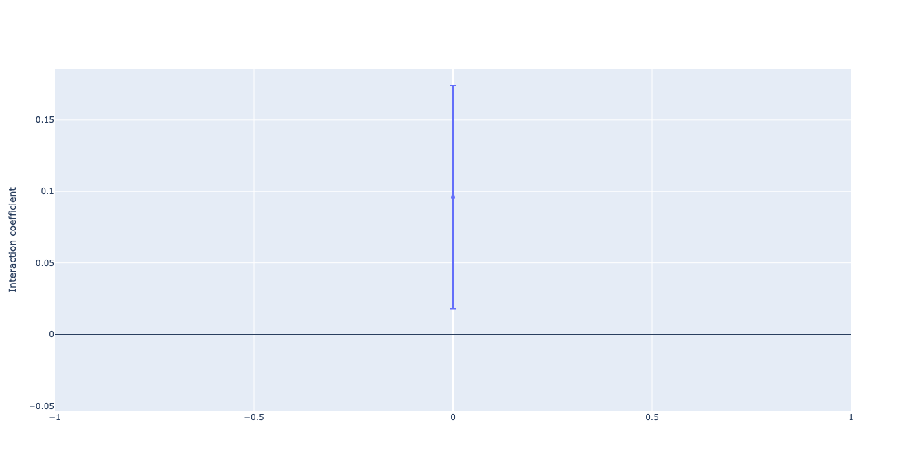](https://htmlpreview.github.io/?https://github.com/Shaadalam9/multiped-learning/blob/main/figures/MM4_equivalence_trigger_mean.html)
Equivalence plot for the dataset by yielding interaction coefficient on mean continuous unsafety, showing the confidence interval relative to the equivalence bounds.

[](https://htmlpreview.github.io/?https://github.com/Shaadalam9/multiped-learning/blob/main/figures/between_subject_missingness_trigger_mean.html)
Participant level distribution of missingness for mean continuous unsafety across datasets.

[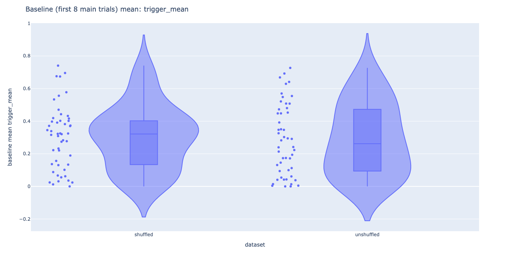](https://htmlpreview.github.io/?https://github.com/Shaadalam9/multiped-learning/blob/main/figures/between_subject_baseline_mean_trigger_mean.html)
Participant level distribution of baseline mean mean continuous unsafety computed from the first main trials of the session.

[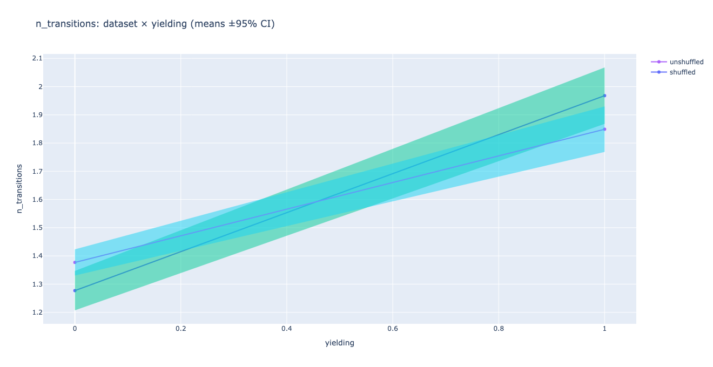](https://htmlpreview.github.io/?https://github.com/Shaadalam9/multiped-learning/blob/main/figures/MM1_means_n_transitions_dataset_yielding.html)
Descriptive means plot for number of trigger transitions by dataset and yielding condition.

[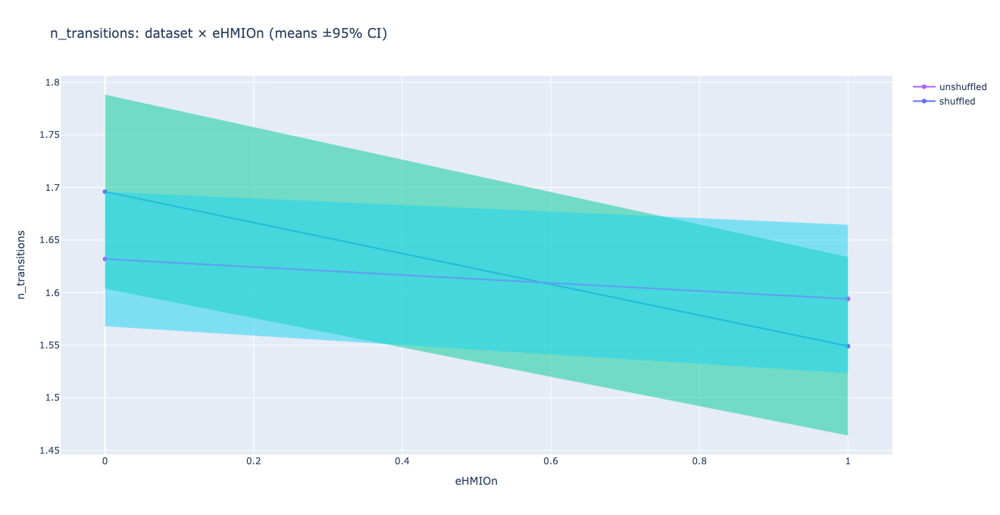](https://htmlpreview.github.io/?https://github.com/Shaadalam9/multiped-learning/blob/main/figures/MM1_means_n_transitions_dataset_eHMIOn.html)
Descriptive means plot for number of trigger transitions by dataset and eHMI condition.

[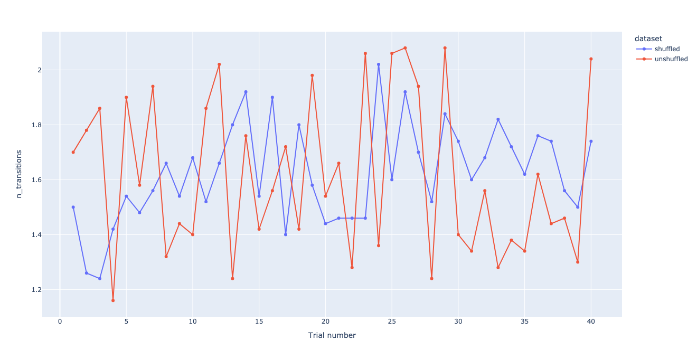](https://htmlpreview.github.io/?https://github.com/Shaadalam9/multiped-learning/blob/main/figures/MM2_curve_n_transitions_over_trial_index.html)
Mean trajectory of number of trigger transitions over trial position by dataset, shown as a descriptive companion to the mixed effects learning model.

[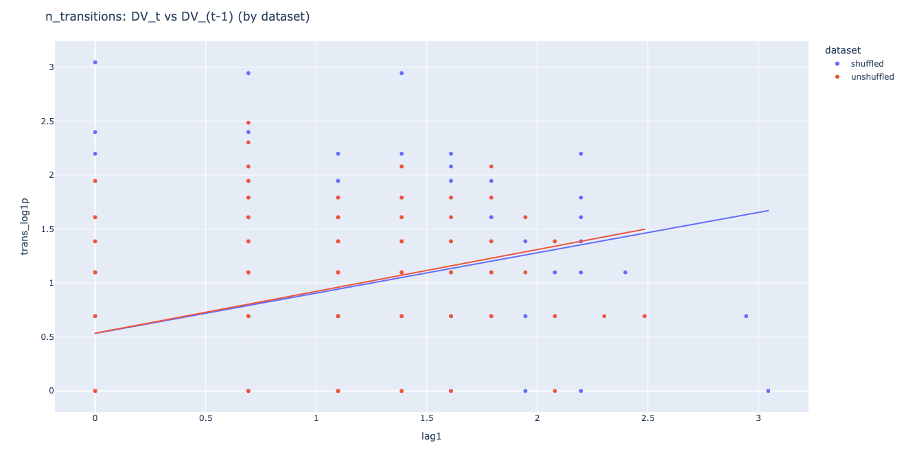](https://htmlpreview.github.io/?https://github.com/Shaadalam9/multiped-learning/blob/main/figures/MM3_scatter_lag_n_transitions.html)
Descriptive lag scatter for number of trigger transitions, showing the relation between the current trial and the immediately previous trial by dataset.

[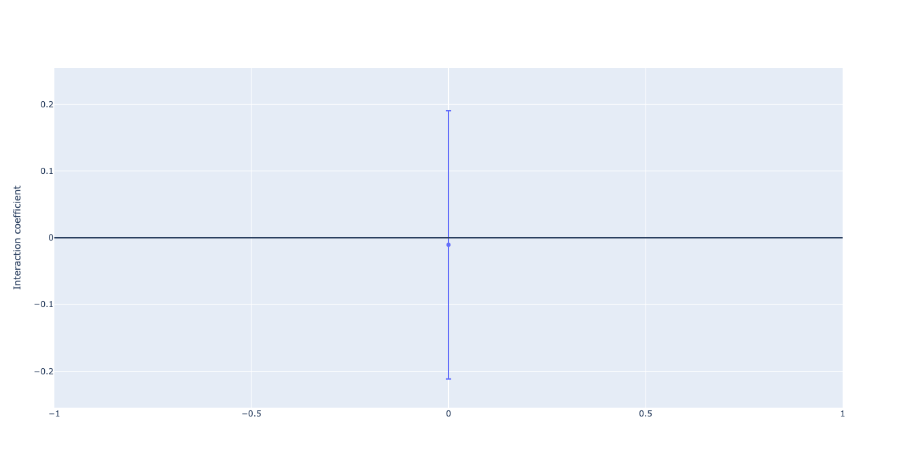](https://htmlpreview.github.io/?https://github.com/Shaadalam9/multiped-learning/blob/main/figures/MM4_equivalence_n_transitions.html)
Equivalence plot for the dataset by yielding interaction coefficient on number of trigger transitions, showing the confidence interval relative to the equivalence bounds.

[](https://htmlpreview.github.io/?https://github.com/Shaadalam9/multiped-learning/blob/main/figures/between_subject_missingness_n_transitions.html)
Participant level distribution of missingness for number of trigger transitions across datasets.

[](https://htmlpreview.github.io/?https://github.com/Shaadalam9/multiped-learning/blob/main/figures/between_subject_baseline_mean_n_transitions.html)
Participant level distribution of baseline mean number of trigger transitions computed from the first main trials of the session.

[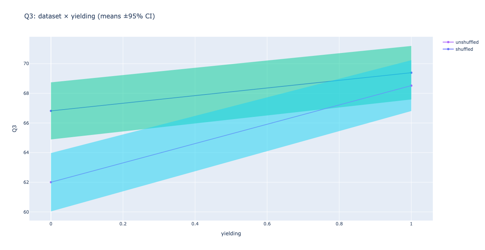](https://htmlpreview.github.io/?https://github.com/Shaadalam9/multiped-learning/blob/main/figures/MM1_means_Q3_dataset_yielding.html)
Descriptive means plot for Q3 rating by dataset and yielding condition.

[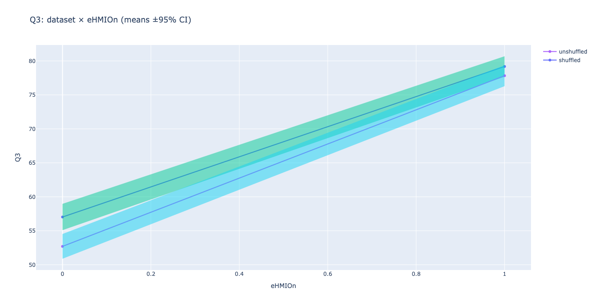](https://htmlpreview.github.io/?https://github.com/Shaadalam9/multiped-learning/blob/main/figures/MM1_means_Q3_dataset_eHMIOn.html)
Descriptive means plot for Q3 rating by dataset and eHMI condition.

[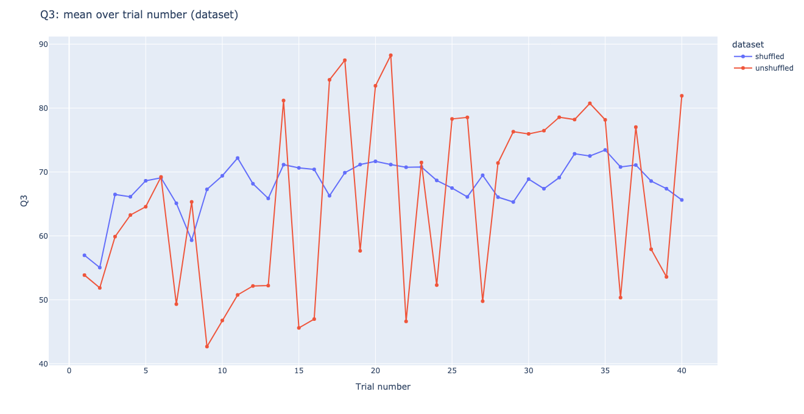](https://htmlpreview.github.io/?https://github.com/Shaadalam9/multiped-learning/blob/main/figures/MM2_curve_Q3_over_trial_index.html)
Mean trajectory of Q3 rating over trial position by dataset, shown as a descriptive companion to the mixed effects learning model.

[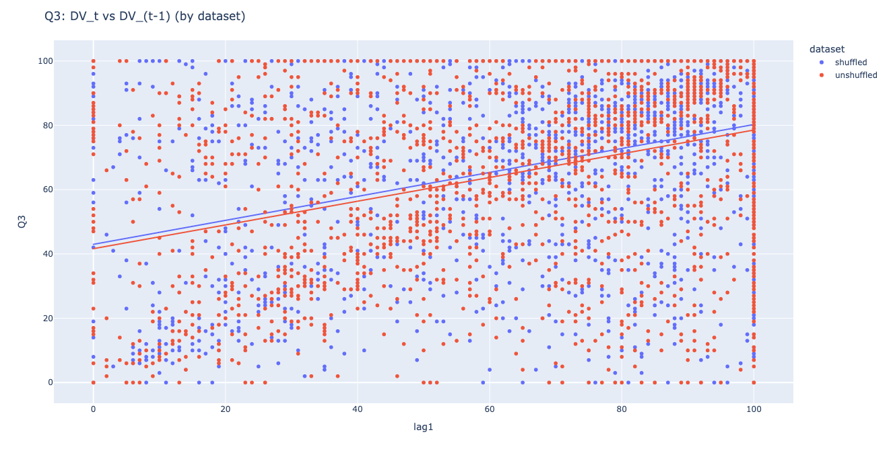](https://htmlpreview.github.io/?https://github.com/Shaadalam9/multiped-learning/blob/main/figures/MM3_scatter_lag_Q3.html)
Descriptive lag scatter for Q3 rating, showing the relation between the current trial and the immediately previous trial by dataset.

[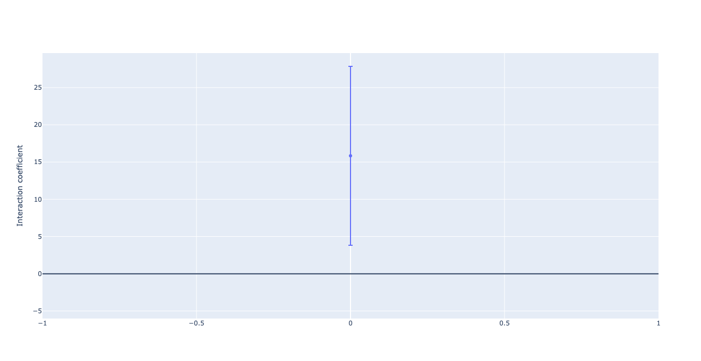](https://htmlpreview.github.io/?https://github.com/Shaadalam9/multiped-learning/blob/main/figures/MM4_equivalence_Q3.html)
Equivalence plot for the dataset by yielding interaction coefficient on Q3 rating, showing the confidence interval relative to the equivalence bounds.

[](https://htmlpreview.github.io/?https://github.com/Shaadalam9/multiped-learning/blob/main/figures/between_subject_missingness_Q3.html)
Participant level distribution of missingness for Q3 rating across datasets.

[](https://htmlpreview.github.io/?https://github.com/Shaadalam9/multiped-learning/blob/main/figures/between_subject_baseline_mean_Q3.html)
Participant level distribution of baseline mean Q3 rating computed from the first main trials of the session.

[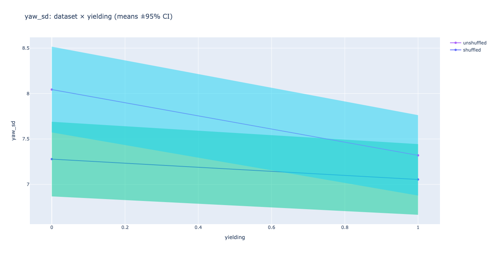](https://htmlpreview.github.io/?https://github.com/Shaadalam9/multiped-learning/blob/main/figures/MM1_means_yaw_sd_dataset_yielding.html)
Descriptive means plot for head yaw standard deviation by dataset and yielding condition.

[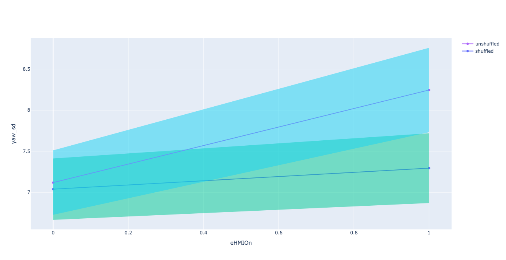](https://htmlpreview.github.io/?https://github.com/Shaadalam9/multiped-learning/blob/main/figures/MM1_means_yaw_sd_dataset_eHMIOn.html)
Descriptive means plot for head yaw standard deviation by dataset and eHMI condition.

[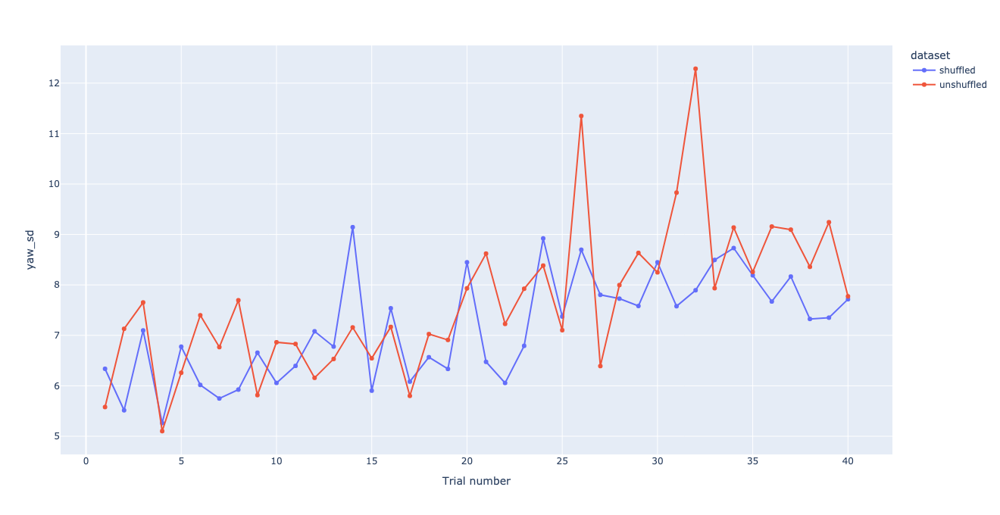](https://htmlpreview.github.io/?https://github.com/Shaadalam9/multiped-learning/blob/main/figures/MM2_curve_yaw_sd_over_trial_index.html)
Mean trajectory of head yaw standard deviation over trial position by dataset, shown as a descriptive companion to the mixed effects learning model.

[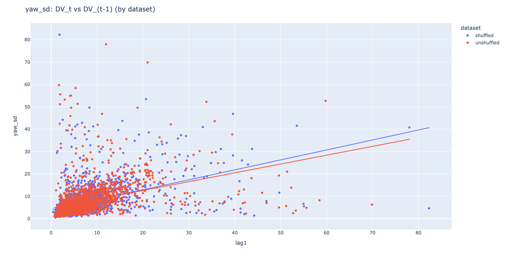](https://htmlpreview.github.io/?https://github.com/Shaadalam9/multiped-learning/blob/main/figures/MM3_scatter_lag_yaw_sd.html)
Descriptive lag scatter for head yaw standard deviation, showing the relation between the current trial and the immediately previous trial by dataset.

[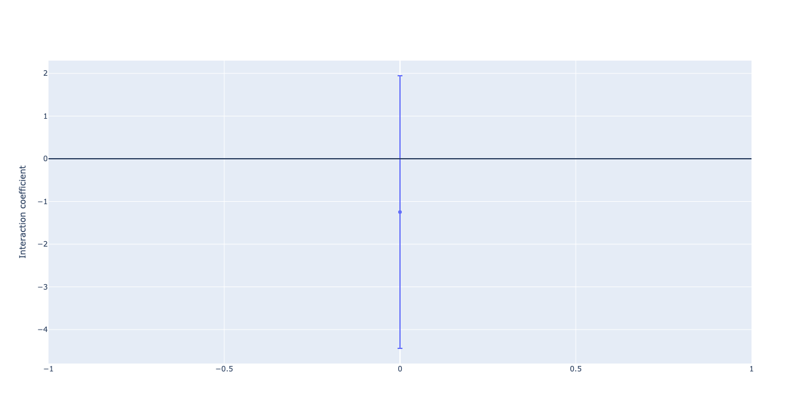](https://htmlpreview.github.io/?https://github.com/Shaadalam9/multiped-learning/blob/main/figures/MM4_equivalence_yaw_sd.html)
Equivalence plot for the dataset by yielding interaction coefficient on head yaw standard deviation, showing the confidence interval relative to the equivalence bounds.

[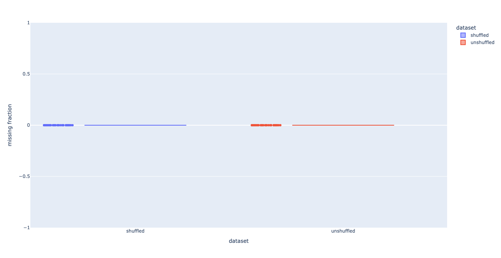](https://htmlpreview.github.io/?https://github.com/Shaadalam9/multiped-learning/blob/main/figures/between_subject_missingness_yaw_sd.html)
Participant level distribution of missingness for head yaw standard deviation across datasets.

[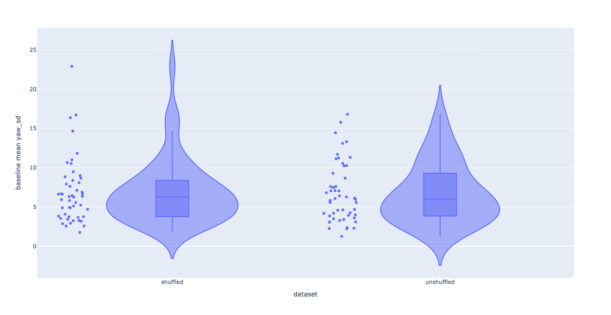](https://htmlpreview.github.io/?https://github.com/Shaadalam9/multiped-learning/blob/main/figures/between_subject_baseline_mean_yaw_sd.html)
Participant level distribution of baseline mean head yaw standard deviation computed from the first main trials of the session.

[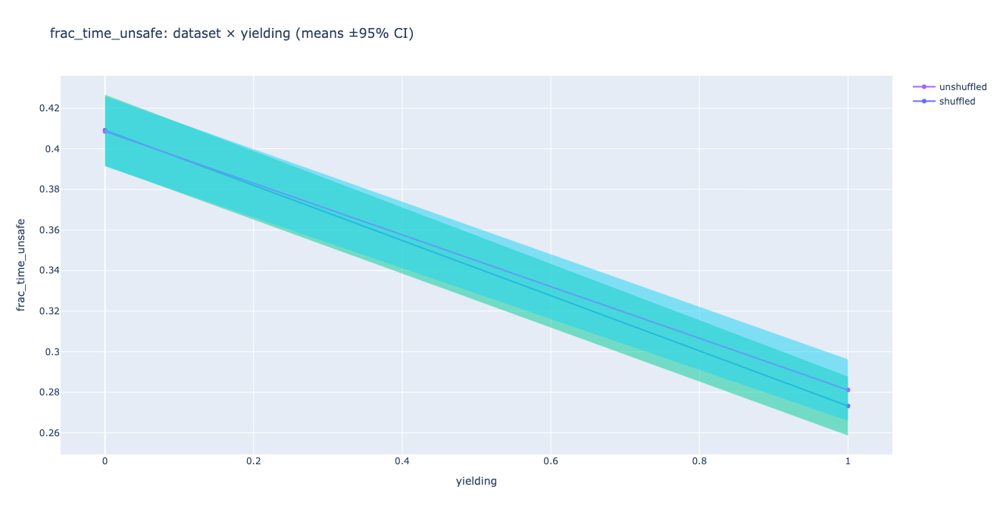](https://htmlpreview.github.io/?https://github.com/Shaadalam9/multiped-learning/blob/main/figures/MM1_means_frac_time_unsafe_dataset_yielding.html)
Descriptive means plot for fraction of trial time in unsafe zone by dataset and yielding condition.

[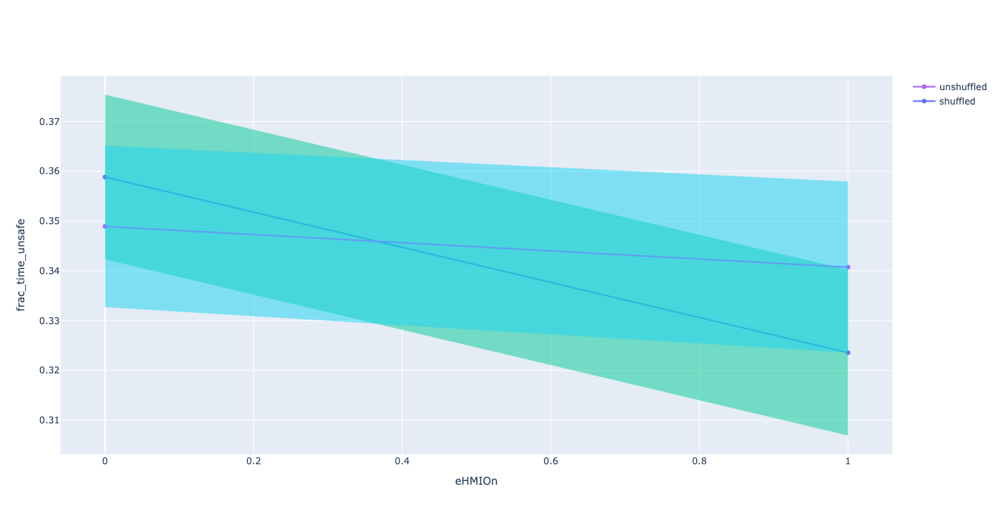](https://htmlpreview.github.io/?https://github.com/Shaadalam9/multiped-learning/blob/main/figures/MM1_means_frac_time_unsafe_dataset_eHMIOn.html)
Descriptive means plot for fraction of trial time in unsafe zone by dataset and eHMI condition.

[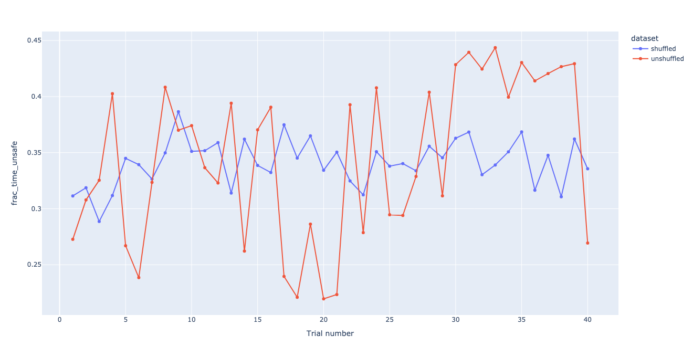](https://htmlpreview.github.io/?https://github.com/Shaadalam9/multiped-learning/blob/main/figures/MM2_curve_frac_time_unsafe_over_trial_index.html)
Mean trajectory of fraction of trial time in unsafe zone over trial position by dataset, shown as a descriptive companion to the mixed effects learning model.

[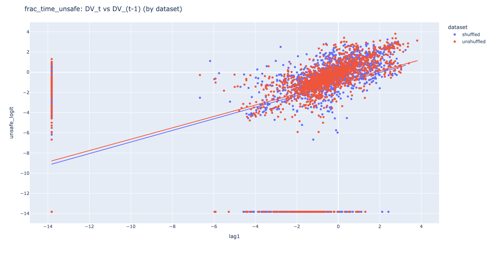](https://htmlpreview.github.io/?https://github.com/Shaadalam9/multiped-learning/blob/main/figures/MM3_scatter_lag_frac_time_unsafe.html)
Descriptive lag scatter for fraction of trial time in unsafe zone, showing the relation between the current trial and the immediately previous trial by dataset.

[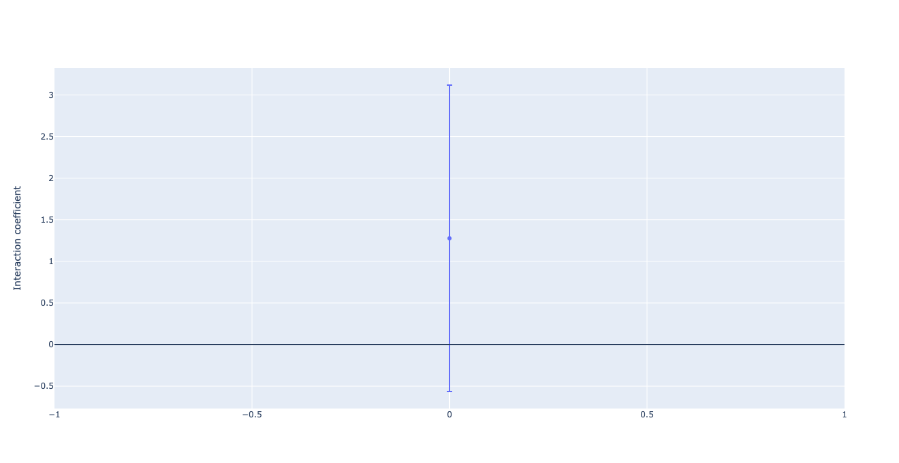](https://htmlpreview.github.io/?https://github.com/Shaadalam9/multiped-learning/blob/main/figures/MM4_equivalence_frac_time_unsafe.html)
Equivalence plot for the dataset by yielding interaction coefficient on fraction of trial time in unsafe zone, showing the confidence interval relative to the equivalence bounds.

[](https://htmlpreview.github.io/?https://github.com/Shaadalam9/multiped-learning/blob/main/figures/between_subject_missingness_frac_time_unsafe.html)
Participant level distribution of missingness for fraction of trial time in unsafe zone across datasets.

[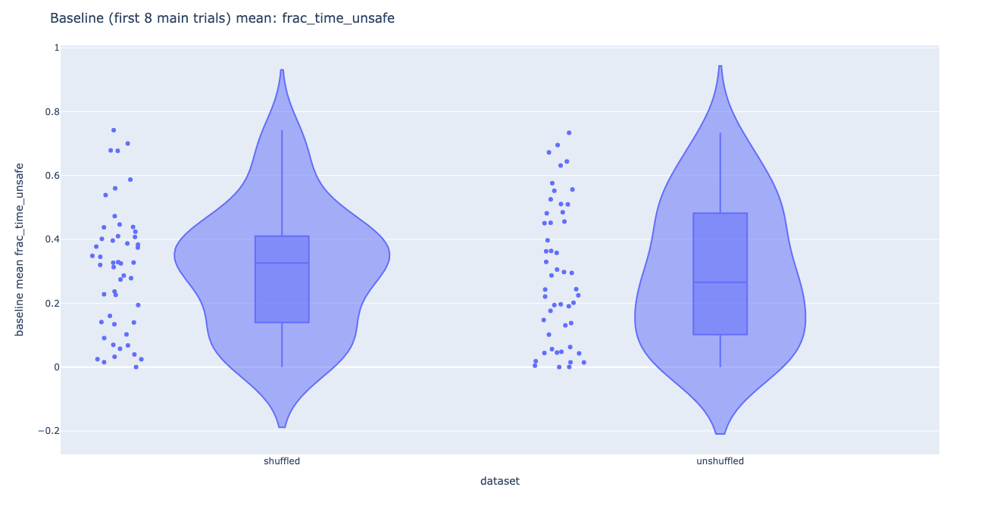](https://htmlpreview.github.io/?https://github.com/Shaadalam9/multiped-learning/blob/main/figures/between_subject_baseline_mean_frac_time_unsafe.html)
Participant level distribution of baseline mean fraction of trial time in unsafe zone computed from the first main trials of the session.

## Data dependent questionnaire moderation figures

[](https://htmlpreview.github.io/?https://github.com/Shaadalam9/multiped-learning/blob/main/figures/F1_scatter_<moderator>_vs_<outcome>.html)
Template for the questionnaire moderation scatter plots. Replace <moderator> and <outcome> with the exported names used in your run.

[](https://htmlpreview.github.io/?https://github.com/Shaadalam9/multiped-learning/blob/main/figures/F1_violin_<outcome>_by_<moderator>_median_split.html)
Template for the questionnaire moderation violin plots. Replace <moderator> and <outcome> with the exported names used in your run.

